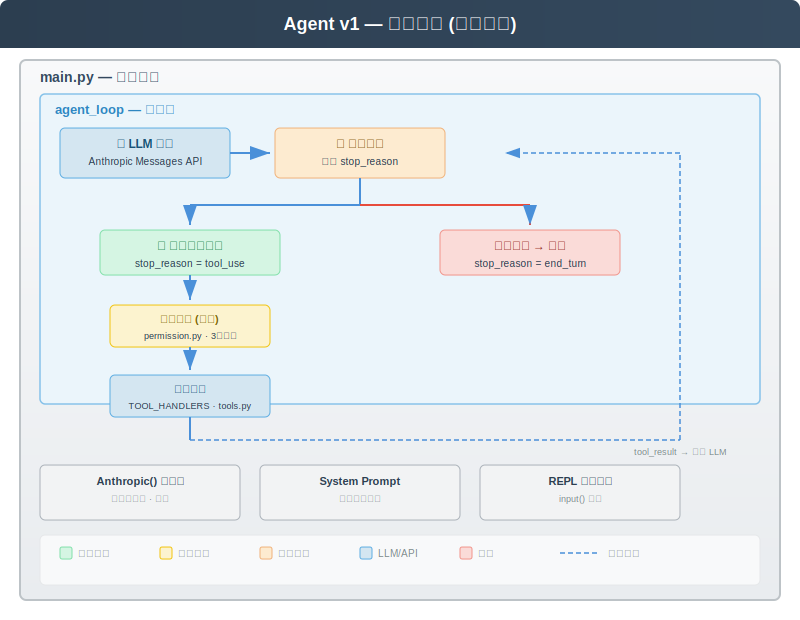
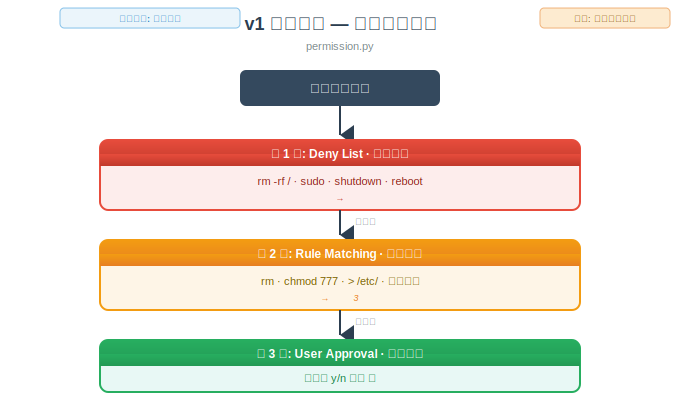
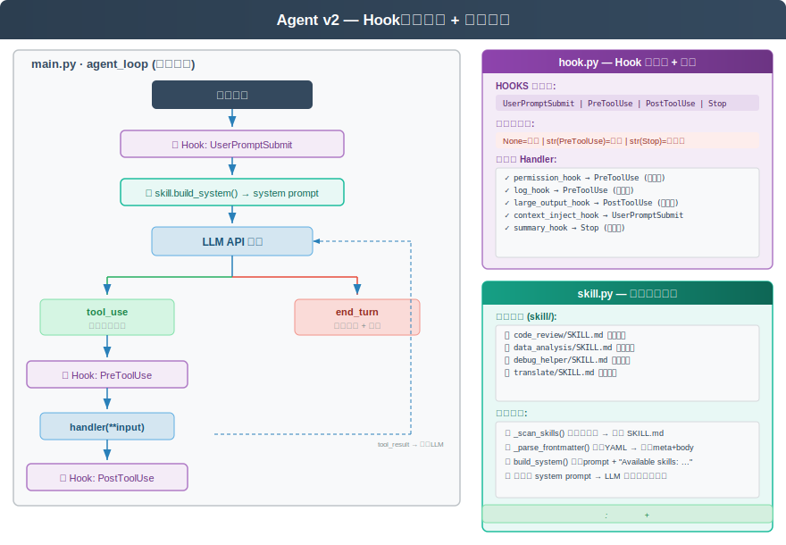
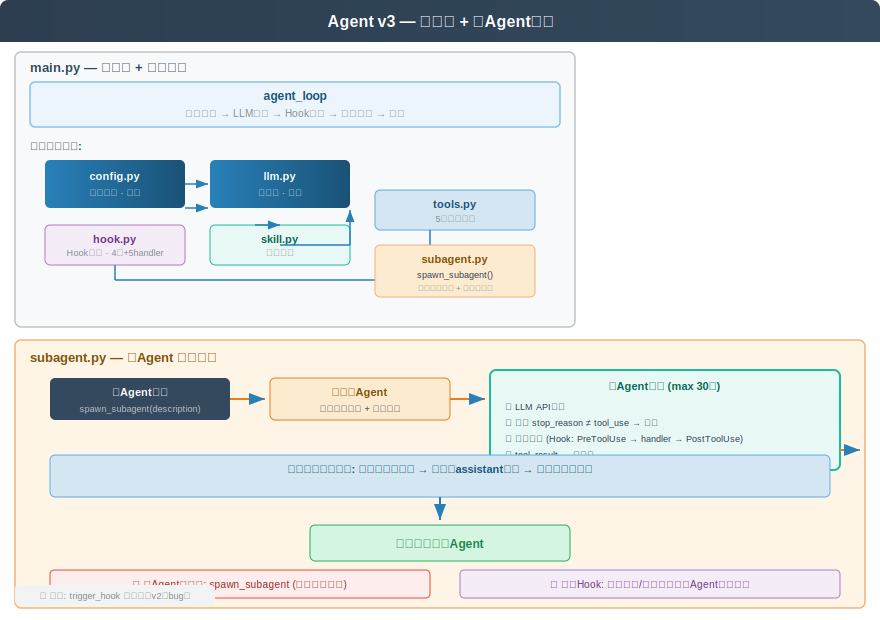
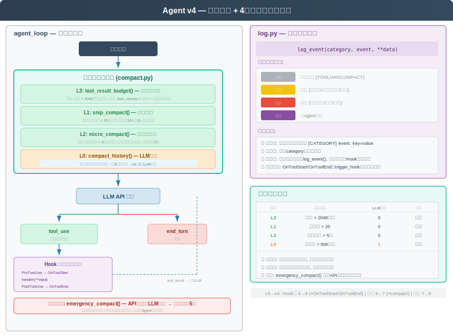
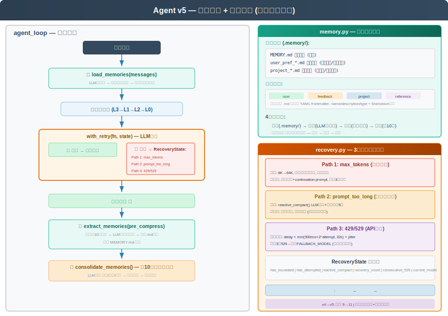
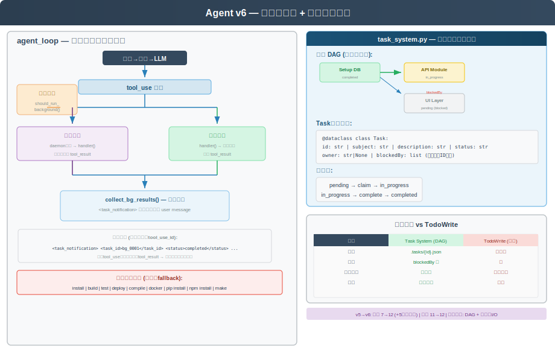
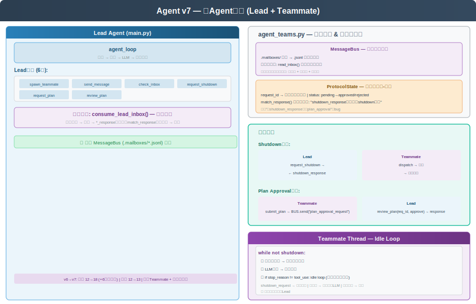
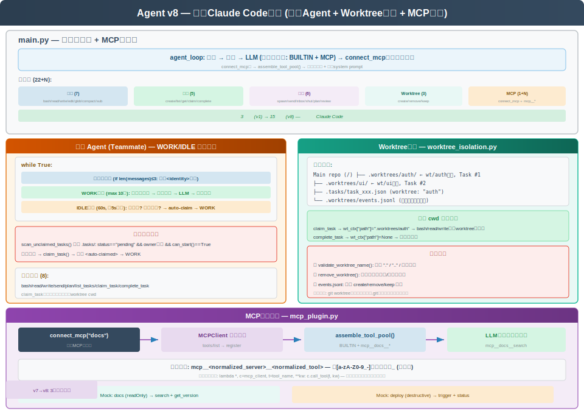

# Agent 架构完整总览

> 从 v1 到 v8 的八次迭代，逐步构建一个完整的 Claude Code 架构复现。
> 本文档将各版本 README 的内容合并为一，按版本顺序完整呈现。

---

## 版本全景

| 维度 | v1 | v2 | v3 | v4 | v5 | v6 | v7 | v8 |
|---|---|---|---|---|---|---|---| 
| **文件数** | 3 | 5 | 7 | 9 | 11 | 12 | 13 | 15 |
| **Hook系统** | — | 4事件 | 4事件 | 6事件 | 6事件 | 6事件 | 6事件 | 6事件 |
| **权限系统** | 独立模块 | Hook包装 | Hook包装 | Hook包装 | Hook包装 | Hook包装 | Hook包装 | Hook包装 |
| **技能系统** | — | SKILL.md | SKILL.md | SKILL.md | SKILL.md | SKILL.md | SKILL.md | SKILL.md |
| **子Agent** | — | — | ✓ | ✓ | ✓ | ✓ | ✓ | ✓ |
| **上下文压缩** | — | — | — | 4级管线 | 4级管线 | 4级管线 | 4级管线 | 4级管线 |
| **统一日志** | — | — | — | ✓ | ✓ | ✓ | ✓ | ✓ |
| **持久记忆** | — | — | — | — | ✓ | ✓ | ✓ | ✓ |
| **错误恢复** | — | — | — | — | 3条路径 | 3条路径 | 3条路径 | 3条路径 |
| **任务系统** | — | — | — | — | — | DAG+后台 | DAG+后台 | DAG+后台+认领 |
| **多Agent协作** | — | — | — | — | — | — | 消息总线+协议 | 消息总线+协议+自主 |
| **Worktree隔离** | — | — | — | — | — | — | — | ✓ |
| **MCP插件** | — | — | — | — | — | — | — | ✓ |
| **Lead工具数** | 5 | 6 | 7 | 7 | 7 | 12 | 18 | 22 |

## 版本演进路线

| 版本 | 核心主题 | 关键新增模块 | 解决的核心矛盾 |
|---|---|---|---|
| v1 | 最简实现 | 3文件 | 验证"LLM Agent可以工作" |
| v2 | Hook+技能 | hook.py, skill.py | 不修改主循环就能扩展能力 |
| v3 | 模块化+子Agent | config.py, llm.py, subagent.py | 拆解单体+委派复杂任务 |
| v4 | 日志+压缩 | log.py, compact.py | 观察运行状态+防止上下文溢出 |
| v5 | 记忆+恢复 | memory.py, recovery.py | 跨会话知识存取+应对API故障 |
| v6 | 任务系统 | task_system.py | 管理多步骤依赖+慢操作不阻塞 |
| v7 | 多Agent协作 | agent_teams.py | 多Agent像团队一样并行工作 |
| v8 | 完整架构 | worktree_isolation.py, mcp_plugin.py | 自组织+文件隔离+插件扩展 |

## 架构演进的深层规律

**横切关注点的外移**：v1权限在主循环 → v2通过Hook外移 → v4日志自动派发 → v5记忆Hook注入。关注点从核心逻辑持续向外移动。

**从中心化到去中心化**：v3子Agent受主Agent控制 → v6任务自动解锁 → v7 Teammate持续待命 → v8自主Agent发现任务。控制权从Leader下放给Teammate。

**接口的标准化**：v1 ad-hoc字典 → v2 Hook注册表 → v7结构化协议 → v8 MCP标准化协议。从隐式约定向显式契约演化。

**五层架构最终形态**：


---

# Agent v1 — 最简实现

## 1. 概述

v1 是编码智能体的最简实现，仅 3 个文件，目标是验证 Anthropic Messages API + tool_use 的基本可用性。整个系统没有抽象层——权限检查直接内联在主循环中，LLM 客户端在多处重复初始化，配置硬编码在各文件里。

**为何叫"最简实现"？** 因为这 3 个文件构成了 LLM Agent 的"最小可行产品"（MVP）。它验证了一个核心假设：**LLM 可以在代码和文件上执行多步操作，而不只是回答问题**。这是所有后续架构的基础——如果这个假设不成立，后面的 Hook、技能、压缩、记忆都没有意义。

### 1.1 Agent 的核心问题域

在深入代码之前，需要理解 LLM Agent 面临的根本性架构问题：

**① LLM 的"无状态"本质**

LLM 的 API 是一个无状态函数：`f(system, messages, tools) → response`。每次调用都是独立的——LLM 不记得上一次调用了什么工具、上一次返回了什么结果。Agent 的架构必须解决这个"无状态函数如何完成有状态任务"的矛盾。

v1 的解决方案是**将对话历史作为状态载体**：`messages` 列表既是 LLM 的输入，也是 Agent 的短期记忆。每一次工具调用和结果都追加到这个列表中，LLM 通过阅读完整的对话历史来理解当前的上下文。

这与传统软件架构中"变量和数据库存储状态"的模式根本不同。Agent 的状态不是存储在变量中，而是存储在对话文本中。

**② 工具的双重身份**

在 Agent 系统中，每个工具同时扮演两个角色：
- **对 LLM 而言**：工具是一个"选项"——"我可以选择调用这个工具来获取信息或执行操作"
- **对系统而言**：工具是一个"钩子"——将 LLM 的意图转化为实际的系统调用

这种双重身份导致了 v1 的**双表结构**设计：`TOOLS` 列表（给 LLM 看的选项）和 `TOOL_HANDLERS` 字典（给代码执行的钩子）。两者在逻辑上对应同一个工具，但服务于完全不同的目的。所有基于 Anthropic API 的 Agent 框架都遵循这个模式。

**③ 权限的必然性**

LLM Agent 拥有文件读写和命令执行能力，这必然带来安全风险。v1 采用**纵深防御**策略：不依赖单一检查点，而是多层防线——Deny List（直接拦截已知危险操作）→ Rule Matching（对可疑操作要求确认）→ User Approval（最终的人工判断）。

这种设计牺牲了自动化程度（每步危险操作都需要人工确认），但换来了安全性。后续 v2 将权限检查从主循环中解耦，但三级管道的基本结构保持不变。

## 2. 系统架构



*主循环 agent_loop 是整个系统的核心：LLM调用 → 响应分发 → 权限检查 → 工具执行 → 回传结果，形成一个完整的闭环。*

### 2.1 Agent Loop 理论基础

LLM Agent 的核心是一个**消息驱动的反馈循环**。理解这个循环需掌握三个关键概念：

**① 为什么需要循环？**

LLM 本身是"无状态函数"——给定 prompt，返回 text。但现实任务（如"修复这个bug"）通常需要多步操作：读文件 → 分析代码 → 编辑文件 → 运行测试。每一轮 LLM 只能输出一步操作，所以需要循环来串联多个步骤。

**② 消息序列是 Agent 的"记忆"**

```
[user: "修复 config.py 中的bug"]
  → [assistant: read_file("config.py")]
  → [user: tool_result:<文件内容>]
  → [assistant: edit_file("config.py", ...)]
  → [user: tool_result: 编辑成功]
  → [assistant: "已修复，错误在第12行的拼写"]
```

每一轮 LLM 调用都看到完整的消息历史——这构成了 Agent 的短期记忆。这也是 Agent 区别于传统程序的根本特征：**它通过对话历史理解上下文，而不是通过变量和状态**。

**③ 工具是 Agent 的"手脚"**

LLM 不能直接创建文件、运行命令、访问网络。`tool_use` 是 LLM 表达意图的方式："我希望执行这个操作"。真正的执行由代码完成，执行结果通过 `tool_result` 返回给 LLM。这种"思考-行动-观察"的循环正是 ReAct 范式的实现。

**思考-行动-观察循环（ReAct Pattern）：**
```
思考 (LLM推理)  →  你想做什么？
行动 (工具执行)  →  代码执行你的意图
观察 (tool_result) → 结果如何？继续思考...
```

这种模式让 LLM 能从失败中学习——如果 `grep` 没找到文件，它会换一个搜索模式；如果 `bash` 报错，它会调整命令。

### 2.2 消息协议与角色

Anthropic Messages API 有三种关键角色：

| 角色 | 含义 | 内容类型 |
|---|---|---|
| `user` | 用户或工具结果 | 文本 + `tool_result` 块 |
| `assistant` | LLM 的响应 | 文本 + `tool_use` 块 |
| `system` | 系统级指令（不在消息序列中） | 全局行为规则、工具列表 |

**关键约束**：`user` 和 `assistant` 必须交替出现。`tool_use` 块后必须跟 `tool_result` 块作为下一个 user 消息。这保证了消息序列的结构完整性。

### 2.3 最小 Agent 的实现骨架

理解了以上理论后，v1 的核心代码极其简洁——本质上就是这 30 行：

```python
messages = [{"role": "user", "content": user_input}]
while True:
    response = client.messages.create(
        model=MODEL, max_tokens=MAX_TOKENS,
        system=SYSTEM_PROMPT, messages=messages, tools=TOOLS
    )
    if response.stop_reason == "end_turn":
        print(response.content[0].text)
        break
    for block in response.content:
        if block.type == "tool_use":
            check_permission(block)        # v1特有权权限
            handler = TOOL_HANDLERS[block.name]
            output = handler(**block.input)
            messages.extend([
                {"role": "assistant", "content": [block]},
                {"role": "user", "content": [tool_result(block.id, output)]}
            ])
```

这就是后面对 v8 所有版本的基础。掌握了这 30 行，就掌握了 LLM Agent 的核心。

## 3. 文件结构

```
v1/
├── main.py            # 入口：一切逻辑的容器
├── tools.py           # 工具实现 + 工具定义 + LLM 客户端（重复初始化）
└── permisssion.py     # 权限管道（3 级检查）
```

## 4. 主循环设计

### 4.1 设计思路

v1 的主循环是所有 LLM Agent 架构的起点。它实现的是最原始的 **ReAct 模式**（Reasoning + Acting）：LLM 在每轮中"思考"（推理出下一步需要什么信息或操作），然后"行动"（调用工具），然后"观察"（获取工具结果），再开始下一轮思考。

**为什么 ReAct 模式是 Agent 的正确基础范式？** 在 ReAct 之前，学术界有两种主要的 LLM 增强范式：Chain-of-Thought（CoT）通过提示让 LLM 在输出中展示推理过程，提高了推理质量但无法与外部世界交互；Tool-Augmented LLM 让 LLM 调用工具但缺少多步推理的框架。ReAct 将两者融合——LLM 在推理中决定何时需要工具、在获取工具结果后继续推理。v1 的主循环就是 ReAct 的最简代码实现。

**主循环作为架构的"脊椎"**：在 v1 中，整个系统的所有逻辑都依附在主循环上——权限检查、工具注册、消息管理。这不是"不够模块化"，而是有意为之——在架构的起点，将所有逻辑集中在一个地方有助于理解完整的执行流。后续的版本逐步将不同的关注点从主循环中抽出（v2 抽出 Hook、v3 抽出配置、v4 抽出日志），但主循环作为"脊椎"的角色始终不变。

**while True 循环的风险与合理性**：v1 使用 `while True` 而非带终止条件的循环。这可能看起来很危险——如果 LLM 反复调用工具却不给出最终答案，Agent 会无限运行。但实际上有隐式的终止机制：
1. LLM 在完成推理后返回 `stop_reason == "end_turn"`——这是 LLM 自己判断"我已经有足够的信息来回答问题了"
2. Anthropic API 有 max_tokens 限制——即使 LLM 想无限继续，token 配额也会限制它
3. **但 v1 没有保护机制**——如果 LLM 陷入"尝试-失败-重试"的循环，v1 会一直运行下去。v4 的压缩管线和 v6 的后台执行部分解决了这个问题

### 4.2 循环流程

v1 的主循环分为四个阶段，每个阶段对应 ReAct 模式的一个步骤：

**第一阶段：调用 LLM（推理）**：`client.messages.create(system, messages, tools)`。这一行代码是整个系统的起点——它发送了对话历史、系统指令和可用工具列表给 LLM。LLM 的响应包含推理结果（文本块）和/或工具调用请求（tool_use 块）。

**第二阶段：判断 stop_reason（决策点）**：这是 Agent 架构中最重要的条件分支。`stop_reason` 有两个可能的取值：
- `"end_turn"`：LLM 认为它已经完成了任务，准备输出最终答案。Agent 退出循环。
- `"tool_use"`：LLM 认为它需要更多信息或需要执行操作，请求调用工具。Agent 进入工具执行分支。

这个二元分支对应着人类的两种状态："我想清楚了，这是我的结论" vs "我需要更多信息/我需要做某件事"。Agent 的所有行为都由这个分支决定。

**第三阶段：权限检查（安全守卫）**：在工具执行之前，`check_permission(block)` 对工具调用进行权限审查。这是一个**安全门**——工具不能绕过权限直接执行。v1 的权限系统是内联的（在主循环中直接调用），这是后面 v2 要解决的核心问题。

**第四阶段：执行与回传（行动）**：`handler(**input)` 执行工具的实际操作，结果通过 `tool_result` 追加到消息历史中。这里的关键是信息回传——工具结果不是"存储到某个变量"或"显示给用户"，而是**追加到 LLM 的对话历史中**。这样 LLM 在下一轮就能"看到"工具的执行结果并据此继续推理。

### 4.3 关键缺陷

v1 的缺陷不是"写得不好"，而是**架构选择的结果**。理解这些缺陷的本质有助于理解后续版本的设计动机。

**无异常处理**：v1 的 LLM 调用没有 try/except 包裹。任何异常（网络超时、API 返回 429、token 超限）都会导致 Agent 崩溃退出。这不是"忘记加异常处理"——在 MVP 阶段，让错误直接暴露出来比隐藏它们更有价值。但这也意味着 v1 无法在生产环境中使用。v5 的 recovery.py 系统地解决了这个问题。

**无上下文管理**：`messages` 列表无限增长。每次工具调用追加 2 条消息（assistant tool_use + user tool_result），长会话的消息数轻松达到数百条。LLM 的上下文窗口有硬上限（如 200K token），超出后就无法继续。v4 的压缩管线解决了这个问题——但 v1 的阶段根本不需要压缩，因为会话短到不会触达上限。

**权限内联**：`check_permission()` 直接写在主循环中。这意味着三件事：
1. 主循环的代码必须知道权限的所有细节
2. 修改权限规则需要修改主循环代码
3. 无法在不修改主循环的情况下禁用权限（比如在测试环境中）

v2 通过 Hook 系统解决了这个问题。但 v1 的内联设计也不是错误——在只有 3 个文件的 MVP 中，将 3 个文件改为 4 个（单独的 permission.py）已经是一种初步的模块化。只是 Hook 系统让解耦更彻底。

## 5. 工具系统

### 5.1 设计思路

v1 的工具系统采用**双表结构**：`TOOLS` 列表和 `TOOL_HANDLERS` 字典。这种设计是 Anthropic tool_use API 强制的——API 要求 `tools` 参数是 JSON Schema 数组（给 LLM 理解工具能力），而代码执行需要一个从工具名到函数的映射（给系统执行工具）。

**双表结构的理论基础**：这两种表示服务于不同的消费者——LLM 需要理解"我能做什么"（tools 参数），系统需要知道"怎么做"（TOOL_HANDLERS 字典）。两者在逻辑上描述同一个工具，但在形式和用途上完全不同。

这种分离的一个关键优势是**类型安全**：`tools` 列表中的参数通过 JSON Schema 定义（`{"type": "string", "description": "..."}`），LLM 会生成符合 schema 的参数。`TOOL_HANDLERS` 中的函数使用 Python 的类型提示（`def bash(command: str, ...)`），代码执行时有类型安全保障。虽然两者定义在代码的不同位置，但 LLM 的 schema 定义和执行函数的关系是隐式的——维护者需要确保两者一致——这是后续 MCP 协议要解决的问题。

**与 OpenAI Function Calling 的对比**：OpenAI 的 function calling 使用类似的模式（函数定义 + 参数 schema），但 Anthropic 的 tool_use 有一个关键差异：tool_use 的输出嵌入在 LLM 的思考流中。LLM 可以在"我正在分析这个错误...让我先看日志文件"这样的推理文本后紧跟着 tool_use 块。这种设计使工具调用与思维链自然融合，而 OpenAI 的 function calling 中函数调用和文本输出是分离的。

### 5.4 路径安全

v1 的 `safe_path()` 是后续所有版本的路径安全基础。它的核心逻辑有两步：

1. **符号解析**：`path = (WORKDIR / p).resolve()` —— 将相对路径（包括 `..`、`~`、符号链接）解析为规范化的绝对路径
2. **边界验证**：`path.is_relative_to(WORKDIR)` —— 验证解析后的路径是否在工作区范围内

**`resolve()` 的重要性**：`resolve()` 不只是"把 `../config` 变成 `/home/user/config`"——它还解析符号链接。如果一个恶意用户创建了 `~/project/safe_link -> /etc/passwd`，没有 `resolve()` 的路径检查会认为这是"安全的 project 内文件"。`resolve()` 将符号链接解析为实际的目标路径，然后再检查是否在工作区内。

**`is_relative_to()` vs 字符串比较**：用字符串前缀比较（如 `path_str.startswith(workdir_str)`）来判断路径是否在目录内是有风险的——`/home/user/project` 的字符串以 `/home/user/pro` 开头，而 `/home/user/pro` 是一个完全不同的目录。`is_relative_to()` 使用路径语义级别的比较，避免了这种误判。

**这个模式在 Claude Code 中的对应**：真实的 Claude Code 有更复杂的路径安全机制——不仅限制在工作区内，还对操作类型进行限制（如禁止修改 `.git/` 目录下的文件、禁止执行不在工作区内的二进制文件）。但核心原理与 v1 的 `safe_path()` 相同：**解析 → 验证边界**——这是一个安全路径操作的通用模式。

### 5.2 工具定义

每个工具包含三部分：
- **name**：工具名称，LLM 通过此名称调用
- **description**：功能描述，帮助 LLM 决定何时使用
- **input_schema**：JSON Schema，定义参数类型和必填项

### 5.3 工具清单

| 工具 | 功能 | 实现要点 |
|---|---|---|
| `bash` | 执行 shell 命令 | subprocess.run，120s 超时，输出截断 50K 字符 |
| `read_file` | 读取文件 | 逐行读取，支持 limit 参数限制行数 |
| `write_file` | 写入文件 | 自动创建父目录，覆盖写入 |
| `edit_file` | 精确替换 | 单次替换（replace 第 3 参数为 1），防止误改多处 |
| `glob` | 文件搜索 | 基于 Python glob 模块，返回相对路径 |

### 5.4 路径安全

`safe_path()` 函数确保所有文件操作都在工作区内：
```python
path = (WORKDIR / p).resolve()
if not path.is_relative_to(WORKDIR):
    raise ValueError("Path escapes workspace")
```
这是所有后续版本的路径安全基础——通过 `resolve()` 解析符号链接和 `..`，再用 `is_relative_to()` 验证结果仍在工作区内。

## 6. 权限管道

### 6.1 设计思路

权限检查采用**管道模式**（Pipeline Pattern）：3 级检查逐级处理，任何一级拦截即可阻断执行。

**管道模式的架构分析**：管道模式的核心思想是"数据流经一系列处理器，每个处理器可以放行、修改或拦截"。v1 的三级管道是最简单的管道实现——没有状态传递（每一级独立判断），没有短路设计（但从第一级命中的概率最高开始排列），没有异步（同步执行）。

管道的顺序不是随机的——它体现了**防御深度**的策略：
- **Deny List 第一级**：拦截已知的危险操作（`rm -rf /`、`sudo`、`shutdown`），在任何上下文中都是危险的，不需要判断上下文
- **Rule Matching 第二级**：识别可疑的操作模式（`rm file.txt`、`chmod 777`），在某些上下文中合法但需要用户确认
- **User Approval 第三级**：规则匹配到的操作需要用户明确输入 y/n 确认

**为什么纵深防御对 Agent 安全至关重要**：Agent 面临的安全问题与传统 Web 应用不同——攻击者不是外部黑客，而是**LLM 本身**。LLM 可能因为理解错误、提示注入、或幻觉而生成危险的工具调用。单一的检查点容易被绕过（如 `cp /dev/null file` 同样会破坏文件但没有 `rm` 关键词）。多级防御增加了绕过的难度。

**Deny List vs Allow List 的本质权衡**：Deny List（默认允许、例外禁止）是务实的选择——Agent 需要执行大量合法操作，如果每个操作都要用户批准就无法使用。Allow List（默认禁止、例外允许）提供更强的安全性但有极高的使用成本——用户需要预先声明所有允许的操作。Claude Code 在两者之间选择了 Deny List + 交互式确认的混合方案，这也是大多数 Agent 框架的选择。

### 6.2 三级管道



*三级纵深防御设计：Deny List（直接拦截）→ Rule Matching（交互确认）→ User Approval（手动确认），不依赖单一检查点。*

### 6.3 理论局限

v1 的权限管道有三个根本性的架构局限：

**无上下文感知**：权限检查是**操作级别的**，不是**意图级别的**。`rm -rf /tmp/build/` 可能是构建系统的正常清理操作，也可能是危险的文件删除。v1 无法区分——它只能匹配 `rm` 关键词。真实的 Claude Code 通过上下文感知部分缓解——权限检查考虑工作目录、之前的操作序列、用户的明确指示。

**阻断即终止——缺失恢复路径**：当权限检查阻断了一个工具调用后，LLM 收到 `"BLOCKED: Dangerous command detected"` 的 tool_result。LLM 可能尝试替代方案，但如果替代方案也被拒绝，Agent 将陷入僵局——无法完成任务，也没有清晰解释"为什么被拒绝，用户可以做什么"。

**无运行时策略变更**：权限规则在代码中硬编码。如果需要临时禁用某个规则（如测试环境中允许 `sudo`），必须修改代码并重启。v2 的 Hook 系统使权限检查可动态注册/注销，但没有提供面向用户的策略配置界面。

## 7. 局限性总结

| 维度 | v1 的状态 | 问题 |
|---|---|---|
| 配置 | 硬编码在各文件 | 无法统一管理，修改需改多处 |
| LLM 客户端 | 多处重复初始化 | 浪费资源，配置不一致 |
| 权限 | 内联在主循环 | 无法扩展，与其他逻辑耦合 |
| 技能 | 无 | 系统提示词固定，无法动态扩展 |
| 子 Agent | 无 | 无法分派子任务 |
| 上下文 | 无管理 | 长会话必然溢出 |
| 日志 | 无 | 调试困难 |

v1 的价值在于验证可行性，其所有缺陷都是 v2-v8 迭代的驱动力。

### 7.1 v1 的架构设计缺陷分析

v1 的缺陷不是"没做完"，而是**架构层面的根本性限制**：

**① 紧耦合的代价**

v1 的所有逻辑都在一个文件里（实际上分布在 3 个文件但高度耦合），这带来了"写起来快、改起来慢"的问题。当需求变化时——比如想增加一个新的权限规则——必须在 `agent_loop` 的主循环中添加代码。这不是能力问题，而是**架构缺乏扩展点**的问题。

对比传统软件工程：如果一个 Web 框架要求每次添加路由都必须修改框架源码，那它永远无法成为通用框架。v1 面临同样的问题——它能让一个具体的 Agent 跑起来，但不能让不同的 Agent 配置不同的行为。

**② 消息序列的状态膨胀**

v1 将整个对话历史保存在内存的 `messages` 列表中。对于一个简单的"读取文件并回答"的任务，消息历史可能只有 3-4 条。但对于"分析整个代码库"的任务，消息历史可能膨胀到数万条。每条消息都消耗 token，而 token 有硬上限（如 200K）。

这是 LLM Agent 面临的根本性矛盾：**越复杂的任务需要越多的推理步骤，越多的步骤产生越长的对话历史，越长的历史越接近 token 上限**。v1 对此完全没有应对机制。

**③ 工具集的脆弱性**

v1 的工具集是固定的 5 个工具。如果需要添加第 6 个工具，必须在 `tools.py` 中添加新的 schema 和 handler。这本身不复杂——但问题在于，工具定义和权限检查、路径安全、错误处理是分散在多处的。新增一个工具需要同时修改多个位置，容易遗漏。

后续 v2 通过 Hook 系统解决了这个问题——hook 在工具执行前后自动注入，新工具自动获得权限检查和日志记录。

### 7.2 为什么这些缺陷是有意为之

v1 的"不完备"是一个深思熟虑的设计决策。如果一开始就设计一个"完美的、可扩展的 Agent 框架"，代码量会急剧膨胀，核心的 agent_loop 逻辑会被基础设施代码淹没。

v1 的策略是**先验证核心假设，再逐步添加基础设施**。这种"增量构建"的方式有以下优势：
- 读者可以看到每个版本解决什么问题、为什么这样解决
- 每个增加的模块都有明确的动机——不是"因为应该这样做"，而是"因为上一个版本遇到了这个问题"
- 最终 v8 的完整架构可以追溯到 v1 的 30 行核心代码——理解这 30 行，就理解了整个架构的起点


---

---

# Agent v2 — Hook 系统 + 技能加载

## 1. 概述

v2 的核心改进是引入 **Hook 生命周期系统**和**技能系统**。Hook 将权限控制、日志记录、输出监控等横切关注点从主循环中抽离，使 `agent_loop` 变为纯编排层。技能系统通过 Markdown + YAML frontmatter 动态扩展系统提示词。

这两个改进的理论基础是**关注点分离**（Separation of Concerns）：主循环只负责"调用 LLM → 分发工具 → 回传结果"的编排逻辑，所有"什么时候该拦截、什么时候该警告、什么时候该记录"都由 Hook 处理。

### 1.1 关注点分离的深层分析

v1 的主循环是"聚合型"设计——编排逻辑、权限检查、日志输出全部混在一起。这不是"代码写得不好"，而是**架构缺乏边界**。当不同职责的代码混在一起时，会出现三个问题：

**① 修改的涟漪效应**

在 v1 中，如果想让"日志格式从纯文本变为 JSON"，必须修改主循环代码。但主循环代码也包含编排逻辑和权限检查——修改一处可能影响其他完全无关的功能。这违反了**单一职责原则**（一个模块应该只有一个导致它变化的原因）。

**② 测试的不可分割性**

v1 的主循环无法对权限逻辑做独立测试——要测试权限，必须启动整个 Agent。v2 通过 Hook 将权限逻辑提取为独立的 `permission_hook` 函数，可以单独加载和测试。

**③ 能力的不可组合性**

在 v1 中，如果想同时启用"大输出警告"和"破坏性命令确认"，需要在主循环中插入两段代码。这两段代码的顺序、交互、异常处理都需要手动管理。v2 的 Hook 注册表让组合变得简单——注册两个 handler，按顺序执行，第一个非 None 结果终止链。

### 1.2 事件驱动架构在 Agent 中的应用

Hook 系统本质上是**事件驱动架构**的简化实现。事件驱动架构的核心前提是：**发布者不关心订阅者是谁**。主循环发布 `PreToolUse` 事件，但不关心 `permission_hook` 和 `log_hook` 的存在。这种设计带来了两个关键属性：

**松耦合**：新增 handler 不需要修改主循环代码。v4 的自动日志派发、v5 的记忆注入、v6 的后台分发都是通过注册新 handler 实现的——这些功能的添加没有修改主循环的任何一行编排逻辑。

**可中断性**：事件驱动通常只是"通知"，但 v2 的 Hook 扩展了这个概念——handler 可以返回非 None 值来阻止事件的后续处理。这是借鉴了 Web 框架中间件的"短路"概念（如 Express.js 的 `res.status(403).end()`）。这种设计让 Hook 从被动的观察者升级为主动的守卫。

## 2. 系统架构



*主循环 agent_loop 通过 Hook 生命周期（UserPromptSubmit → PreToolUse → PostToolUse → Stop）与横切关注点解耦，技能系统动态组装 system prompt。*

## 3. 文件结构

```
v2/
├── main.py            # 入口：agent_loop（纯编排，通过 Hook 交互）
├── tools.py           # 5 个工具实现（与 v1 相同）
├── hook.py            # Hook 注册表 + 触发逻辑 + 5 个 handler ← 新增
├── skill.py           # 技能扫描 + SKILL.md 解析 + 系统提示词构建 ← 新增
└── permisssion.py     # 遗留权限模块（已被 hook.py 中的 permission_hook 替代）
```

## 4. Hook 生命周期系统

### 4.1 设计理论

Hook 系统的设计灵感来自事件驱动架构和中间件模式。核心思想是：**主循环不关心"工具执行前后该做什么"，只关心"调用工具、获取结果"**。所有横切关注点通过 Hook 注入。

**为什么 Hook 是"正确"的抽象级别**：在很多系统中，横切关注点（权限、日志、监控）通过面向切面编程（AOP）实现——在编译时或运行时"织入"额外的代码。AOP 在 Java 生态中流行，但有一个根本问题——织入点不易调试。当权限检查失败时，你很难在调用栈中定位"权限代码是在哪里、何时、被谁注入的"。

Hook 避免了这个问题：`trigger_hook("PreToolUse", block)` 是显式的调用点——你可以清楚地看到 Hook 在何时被触发。同时 `HOOKS` 注册表是全局可检查的——你可以查看所有已注册的 handler。这种**显式隐式结合**（调用点显式、handler 注册隐式）是 Hook 模式的关键设计特征。

**Hook 的"控制权反转"**：在传统的面向过程设计中，主函数调用辅助函数——主函数拥有控制权。在 Hook 模式中，控制权被反转——主循环不知道 handler 会做什么，handler 甚至可能阻止主循环的执行流。这是**好莱坞原则**（"Don't call us, we'll call you"）的体现。框架定义了事件点和触发时机，用户提供的代码在这些点上被回调。

**真实 Claude Code 的 Hook 系统对比**：Claude Code 的 Hook 系统在以下几个方面比 v2 更丰富：
- **条件注册**：handler 可以声明"只在某些条件下触发"（如"只在 Python 项目中触发 code_review skill"）
- **优先级**：handler 有显式优先级而非注册顺序决定执行顺序
- **异步支持**：handler 可以是异步的，支持非阻塞执行（如日志 handler 异步写入）

但核心抽象是相同的：事件→注册表→有序回调。v2 实现的是这个核心抽象。

### 4.3 Hook 返回值语义

Hook 的返回值语义是 v2 的关键设计决策——它定义了 Hook 与主循环之间的**契约**。

**三层返回值语义的架构含义**：

```
返回 None   → 放行，继续执行         （"我对这个操作没有意见"）
返回 str    → 阻断，字符串成为结果     （"我反对这个操作，原因如下..."）
返回 str(Stop) → 强制继续，内容注入   （"不要退出，这里有新信息需要处理"）
```

这个设计借鉴了 Web 中间件的"短路"概念。Express.js 的中间件通过 `next()` 放行、`res.status(403).end()` 阻止请求。v2 的 Hook 通过返回值实现相同的语义——`None` = `next()`，`str` = `res.status(403).end()`。但 v2 扩展了这个概念——Stop 事件上的 `str` 返回意味着"不要退出"，这是 Web 中间件没有的语义。

**为什么返回值语义必须明确**：v2 的 `trigger_hook` 有一个微妙的 bug（在 v3 中修复）——它没有返回 handler 的值。这看似是"忘记 return"的小错误，实际上暴露了接口设计的深层问题——**调用方和实现方对"这个函数是做什么的"有不同理解**。v2 的作者（开发者）认为 `trigger_hook` 是"执行所有 handler"，调用方（主循环）认为 `trigger_hook` 是"检查工具是否应该被阻止"。这种理解偏差是接口缺乏明确契约的直接后果。

### 4.4 已注册的 Handler

五个 Handler 展示了 Hook 系统的三种使用模式：

| Handler | 模式 | 架构意义 |
|---|---|---|
| `permission_hook` | **阻断型** | 横向安全控制。在任何工具执行前检查权限，可阻断危险操作 |
| `log_hook` | **观察型** | 横向可观测性。纯观察无副作用，记录所有工具调用 |
| `large_output_hook` | **警告型** | 横向质量保证。识别异常情况（超大输出），告警但不阻断 |
| `context_inject_hook` | **注入型** | 横向上下文增强。在用户输入前注入额外信息 |
| `summary_hook` | **记录型** | 横向统计。在会话结束时汇总信息 |

**为什么这五种 handler 覆盖了主要的横切关注点模式**：阻断型（安全）、观察型（日志）、警告型（监控）、注入型（上下文）、记录型（统计）。这五种模式基本覆盖了 Agent 系统中所有"不应该在主循环中处理"的逻辑。后续版本添加的 handler 都可以归入这五种模式之一。

### 4.5 权限 Hook 的实现

`permission_hook` 继承了 v1 的 3 级管道逻辑，但通过 Hook 机制注册：

```
permission_hook(block):
    if block.name == "bash":
        command = block.input.get("command", "")
        if 命中 deny list → 返回 "BLOCKED: ..."
        if 命中 rule list → 交互确认 → 返回或 None
    if block.name in ("write_file", "edit_file"):
        if 路径在工作区外 → 交互确认
    return None  # 放行
```

与 v1 的关键区别：权限检查不再写在主循环里，而是作为 PreToolUse handler 被调用。主循环只看到 `trigger_hook("PreToolUse", block)` 的返回值。

## 5. 技能系统

### 5.1 设计理论

技能系统的设计目标是**让 Agent 的能力可扩展，而不需要修改代码**。通过 Markdown 文件定义技能，Agent 可以在运行时动态加载新的行为模式。

**选择 Markdown + YAML frontmatter 的深层原因**：这个选择体现了"配置即代码"哲学的轻量实现。Markdown 而非 JSON 或自定义 DSL，是因为人类可读性（技能定义本身就是文档）、结构化与自由格式的结合（YAML 元数据 + 自由格式正文）、版本控制友好（Markdown diff 可读）。真实的 Claude Code 同样使用 SKILL.md 格式定义技能，包含 prompts、scripts 和 references——v2 实现了核心概念（扫描→解析→注入），省略了脚本执行和资源引用。

### 5.2 技能目录结构

```
skill/
├── code_review/
│   └── SKILL.md        # YAML: name, description + Markdown: 审查规则
├── data_analysis/
│   └── SKILL.md        # YAML: name, description + Markdown: 分析模式
├── debug_helper/
│   └── SKILL.md        # YAML: name, description + Markdown: 调试流程
└── translate/
    └── SKILL.md        # YAML: name, description + Markdown: 翻译规则
```

### 5.3 加载流程

```
① _scan_skills()
   遍历 SKILLS_DIR 下所有子目录
   检查是否包含 SKILL.md

② _parse_frontmatter(text)
   分割 "---" 获取 YAML 部分
   解析 name, description 字段
   返回 (meta, body)

③ build_system()
   基础 prompt + 技能目录列表
   "Available skills: code_review, data_analysis, ..."
   注入到 system prompt 中
```

### 5.4 系统提示词组装

v2 的 system prompt 由 `build_system()` 动态组装：

```
基础 prompt（角色定义）
    +
"Available skills: code_review, data_analysis, debug_helper, translate"
    +
工作目录信息
```

LLM 看到技能列表后，可以根据用户需求选择调用哪个技能。技能的正文（Markdown 部分）在用户请求特定技能时注入。

## 6. 与 v1 的对比

| 维度 | v1 | v2 |
|---|---|---|
| 权限检查 | 内联在主循环 | PreToolUse Hook |
| 日志记录 | 无 | log_hook + summary_hook |
| 输出监控 | 无 | large_output_hook |
| 系统提示词 | 固定字符串 | 动态组装（含技能列表） |
| 可扩展性 | 修改主循环代码 | 注册新 Hook 或添加 SKILL.md |
| 主循环职责 | 编排 + 权限 + 日志 | 纯编排 |

v2 的核心贡献是建立了 Hook 机制，这是后续所有版本扩展的基础——v4 的自动日志派发、v5 的记忆注入、v6 的后台分发都基于 Hook 系统。

### 7.1 Hook 系统的局限性与演进方向

v2 的 Hook 设计打开了扩展的大门，但仍有两个未解决的问题：

**① 无自动触发能力**

v2 的 Hook 必须在代码中显式调用 `trigger_hook()`。如果某个 Hook 应该在"每次工具执行前后"触发，必须在每个调用点手动添加。v4 解决了这个问题——通过在 `trigger_hook` 内部自动派发 `OnToolStart` 和 `OnToolEnd`，工具日志在零代码修改的情况下自动生效。

这种演进反映了 Hook 系统的设计规律：**先提供显式调用能力验证可行性，再添加隐式自动触发降低使用成本**。

**② Handler 执行顺序的语义约定**

v2 的 handler 按注册顺序执行，但没有显式的优先级系统。`permission_hook` 必须先于 `log_hook` 注册，但这种顺序是约定而非强制。在大型系统中，依赖注册约定管理执行顺序会导致脆弱的隐式依赖。真实的 Claude Code 通过更复杂的 Hook 分类（PreToolUse 下分为 blocking/non-blocking 两个子列表）来解决这个问题。

### 7.2 技能系统的设计局限

v2 的技能系统通过 Markdown + YAML frontmatter 定义技能，但存在两个局限：

**技能选择完全由 LLM 决定**：system prompt 中列出了可用技能的名称和描述，LLM 根据用户输入判断是否需要激活某个技能。但如果没有明确请求特定技能，LLM 可能忽略相关技能的存在。真实的 Claude Code 通过 `/` 命令系统（如 `/review` 显式激活 code_review 技能）弥补了这一缺陷。

**技能内容静态注入**：技能的定义在启动时加载一次，运行期间不会变化。这意味着技能不能根据上下文动态调整——一个 code_review 技能对所有语言的代码使用相同的审查规则。后续版本可以通过"上下文感知的技能注入"让技能内容根据项目语言、框架等自适应调整。


---

---

# Agent v3 — 模块化 + 子 Agent

## 1. 概述

v3 实现真正的模块化分离，并引入**子 Agent 架构**。配置中心和 LLM 客户端独立为单独模块，消除重复初始化。子 Agent 允许主 Agent 将子任务委派给独立的 Agent 循环执行，实现任务分解。

v3 还修复了 v2 的关键缺陷：`trigger_hook` 不返回值导致权限 Hook 形同虚设。这个 bug 说明了一个重要的工程教训——**接口设计必须明确返回值语义**，否则调用方无法正确使用。

### 1.1 依赖反转与模块化设计的本质

v1/v2 的问题是"看似有多个文件，实际上是一个文件"。`main.py` 和 `tools.py` 各自初始化 LLM 客户端、各自定义配置——它们通过**复制粘贴**共享逻辑，而不是通过**导入**共享逻辑。这不是真正的模块化，而是"文件级别的代码重复"。

v3 的根本性变化是引入了**依赖方向**的概念。在 v2 中：

```
main.py → 创建自己的 Anthropic 客户端
tools.py → 创建自己的 Anthropic 客户端
         (两者各自为政)
```

在 v3 中：

```
.env → config.py → {main.py, tools.py, hook.py, ...}
         llm.py  → {main.py, tools.py, subagent.py, ...}
```

依赖方向从"横向复制"变为"纵向继承"——所有模块从同一个源头获取配置和客户端。这种变化看似微小，但彻底改变了系统的可维护性：修改一个环境变量，所有模块同时生效；修改客户端初始化逻辑，一处修改全局生效。

### 1.2 子 Agent 的认知模型

子 Agent 不是一个"函数调用"——它是一次**认知委派**。当主 Agent 调用 `spawn_subagent("分析 config.py 的架构问题")` 时，发生的事情不是"执行一个函数并等待返回值"，而是：

1. 创建一个新的 Agent 实例，拥有独立的 LLM 对话
2. 这个子 Agent 自主探索、推理、试错
3. 子 Agent 在完成分析后，将**工作总结**（而非原始工具输出）返回给主 Agent

这模拟了真实团队协作中的"委派"模式——你不需要告诉下属每一步怎么做，只需要说明目标和交付物。

**为什么子 Agent 需要独立循环而不是简单的工具？** 因为有些任务是"开放式"的——你不知道需要读哪些文件、需要运行哪些命令、需要分析多少轮。只有一个有自主推理能力的 Agent 才能处理这种不确定性。工具只能执行确定的单步操作。

**防止无限嵌套的架构决策**：子 Agent 不能派发子 Agent。这不是技术限制，而是**复杂性控制**——每增加一层嵌套，调试难度呈指数级增长。一个三层嵌套的 Agent（A→B→C）出错时，A 只能看到 B 返回的模糊错误信息，无法了解 C 的具体问题。

## 2. 系统架构



*模块化的依赖反转设计（config + llm 单例模式），子Agent通过延迟导入避免循环依赖，共享Hook系统。*

## 3. 文件结构

```
v3/
├── config.py      # 统一配置中心 ← 新增
├── llm.py         # Anthropic 客户端单例 ← 新增
├── main.py        # 入口：agent_loop + 工具注册
├── tools.py       # 5 个工具实现（从 config/llm 导入）
├── hook.py        # Hook 系统（4 点 + 5 handler）
├── skill.py       # 技能加载
└── subagent.py    # 子 Agent 派发 ← 新增
```

## 4. 模块化设计

### 4.1 设计理论

v1/v2 的问题是**紧耦合**：LLM 客户端在 main.py 和 tools.py 中各初始化一次，配置硬编码在各文件中。这违反了**单一事实源**（Single Source of Truth）原则——同一个配置项在多处定义，修改时容易遗漏。

v3 的解决方案是**依赖反转**：所有模块从 config.py 和 llm.py 导入配置和客户端，不再自行创建。这实现了：
- **集中管理**：修改 .env 文件即可改变所有配置
- **单例模式**：LLM 客户端全局唯一，避免重复初始化
- **可测试性**：可以轻松替换配置或客户端进行测试

**设计原则详解：**

**① 单一事实源 (Single Source of Truth)**

v1/v2 中，`MODEL_ID` 被硬编码在 main.py 和 tools.py 两处。如果一个开发者只修改了一处，就会出现"看起来改了，实际上没改"的 bug。v3 将所有配置集中在 `config.py`，通过 `.env` 文件统一管理：

```
修改前 (v2):                     修改后 (v3):
  main.py → MODEL = "claude-3"    .env → MODEL_ID=claude-3
  tools.py → MODEL = "claude-3"   config.py → MODEL = os.environ["MODEL_ID"]
                                   main.py → from config import MODEL
                                   tools.py → from config import MODEL
```

这不是简单的"移到文件顶部"——它改变了配置的权威来源。`.env` 成为唯一的事实源，代码只是消费者。

**② 单例模式在 LLM Agent 中的特殊性**

为什么不每次调用时创建新客户端？答案在于连接开销：
- Anthropic API 客户端的初始化涉及 TLS 握手、认证 token 加载
- 在高频调用场景（Agent 每秒多次 LLM 调用），重复初始化会显著增加延迟
- 单例确保所有模块共享同一个 TCP 连接池

同时，单例也意味着 `ANTHROPIC_BASE_URL` 可以在一个地方设置，全局生效。这对兼容非官方 API 端点（如 DeepSeek、本地 Ollama）至关重要。

**③ 依赖反转的实际效果**

```
v2 的依赖关系 (高耦合):               v3 的依赖关系 (依赖反转):
  main.py → 自己创建 config           main.py → from config import MODEL
  tools.py → 自己创建 config           tools.py → from config import MODEL
  hook.py → 自己创建 config            hook.py → from config import MODEL
  (每处都可能不一致)                   (统一来源，绝对一致)
```

依赖反转的核心不是"谁来创建对象"，而是"谁拥有配置的权威"。v3 将权威从各个模块移到了 config.py。

### 4.2 配置中心（config.py）

`config.py` 是 v3 架构的**数据层入口**。它的职责是将环境变量（来自 `.env` 文件）解析为类型安全的 Python 变量，供所有模块使用。

**配置加载的实现与原理**：
```python
WORKDIR = Path.cwd()
SKILLS_DIR = Path(os.environ.get("SKILLS_DIR", WORKDIR / "skill"))
MODEL = os.environ["MODEL_ID"]
MAX_TOKENS = int(os.environ.get("MAX_TOKENS", "8000"))
SUB_MAX_TOKENS = int(os.environ.get("SUB_MAX_TOKENS", "4000"))
SUB_MAX_TURNS = int(os.environ.get("SUB_MAX_TURNS", "30"))
```

`python-dotenv` 库在程序启动时将 `.env` 文件中的键值对加载到 `os.environ`，`config.py` 通过 `os.environ.get(key, default)` 读取。这里的核心设计决策是**类型转换发生在 config.py 层面而非使用层面**——`int(os.environ.get("MAX_TOKENS", "8000"))` 确保所有使用者拿到的都是 `int` 类型，而非需要各自做 `int()` 转换。

**`config.py` 作为"配置契约"**：所有模块通过 `from config import MODEL` 获取配置，不直接读环境变量。这意味着如果要改变配置来源（如从 `.env` 改为 YAML 文件或远程配置中心），只需修改 `config.py`——其他模块完全不受影响。这是门面模式的另一种应用。

**配置的层次结构**：`WORKDIR` 和 `SKILLS_DIR` 使用 `Path` 类型（路径对象），数值类配置使用 `int` 类型，字符串配置使用 `str` 类型。这个类型转换不是装饰——它使得 Python 的类型检查器能捕获配置类型错误，而 v2 中所有配置都是字符串，类型错误只能运行时发现。

### 4.3 LLM 客户端（llm.py）

`llm.py` 的职责极其简单但架构意义重大：**确保整个系统中只有一个 Anthropic 客户端实例**。

**单例的实现方式**：
```python
client = Anthropic(base_url=os.getenv("ANTHROPIC_BASE_URL"))
```

Python 的模块导入机制天然保证了单例——模块在第一次被 `import` 后缓存在 `sys.modules`，后续的 `import` 返回同一个模块对象。因此模块级别的 `client = Anthropic(...)` 在全局只会执行一次。

**为什么 `ANTHROPIC_BASE_URL` 是可选的**：这个设计考虑了不同 API 提供商。Anthropic 官方 SDK 默认连接 `api.anthropic.com`，但通过 `base_url` 可以指向兼容的 API 端点（如 DeepSeek、本地 Ollama 等）。`os.getenv` 而非 `os.environ` 确保此参数缺失时 SDK 使用默认值。

**单例模式的工程代价**：全局单例的一个缺点是**不可测试性**——所有测试共享同一个客户端，无法为不同测试配置不同的客户端。v3 接受这个代价是因为教学版本的测试需求简单。生产系统通常使用依赖注入容器而非全局单例来解决测试隔离问题。

### 4.4 循环依赖处理

Python 的模块系统不允许循环导入——如果 `subagent.py` 在顶层导入 `tools.py` 的 `TOOL_HANDLERS`，而 `tools.py` 又间接依赖 `subagent.py`，Python 解释器会抛出 `ImportError`。

**延迟导入的实现原理**：`from tools import TOOL_HANDLERS` 不写在模块顶层，而是写在 `spawn_subagent()` 函数内部。当函数被调用时，Python 检查 `sys.modules`——如果 `tools` 模块已在缓存中（因为它被 `main.py` 等模块导入过），直接返回缓存的对象。如果不在缓存中，才真正执行导入。

**为什么延迟导入在 v3 中是正确选择**：`spawn_subagent()` 在实际运行中不会被频繁调用（用户不会每秒钟派发几十个子 Agent），所以每次导入的微小开销（微秒级）完全可忽略。同时，延迟导入保持了模块依赖的清晰性——`subagent.py` 不需要与 `tools.py` 合并，各自保持独立职责。

## 5. 子 Agent 系统

### 5.1 设计理论

子 Agent 的设计动机是**任务分解**：复杂任务可以拆分为多个子任务，每个子任务由独立的 Agent 循环执行。这与人类团队协作的方式类似——项目经理（主 Agent）分配任务给开发者（子 Agent），开发者独立完成后汇报结果。

**子 Agent 的本质：**

子 Agent 不是一个函数调用——它是一个完整的、独立的 Agent 循环。这意味着：
- 子 Agent 有自己的消息历史，独立于主 Agent
- 子 Agent 可以多次调用 LLM，逐步完成任务
- 子 Agent 可以试错：grep 没找到就换 glob，bash 报错就调整命令
- 子 Agent 返回的是"工作总结"，不是原始的工具输出

这与传统编程中的"函数调用"根本不同。函数调用是确定性的——相同的输入产生相同的输出。子 Agent 调用是非确定性的——LLM 可能采取不同的路径来完成任务。

**何时使用子 Agent vs 直接执行工具：**

| 场景 | 使用什么 | 原因 |
|---|---|---|
| 读一个文件 | 直接 read_file | 单步操作，无需推理 |
| 搜索一个函数 | 直接 grep | 单步操作，无需推理 |
| "分析这个模块的性能问题" | 子 Agent | 需要多步推理、阅读多个文件、综合分析 |
| "重构认证逻辑" | 子 Agent | 复杂的、有明确子目标的任务 |
| "修复这个 CI 错误" | 子 Agent | 需要诊断、尝试、验证的迭代过程 |

**子 Agent 的"危险"——为什么限制这么严格：**

每个子 Agent 调用都会消耗 LLM token（可能 10000+），如果无限嵌套，花费将指数级增长。更重要的是，多层嵌套的 Agent 几乎不可能调试——当子 Agent 的子 Agent 出了错，主 Agent 只能看到一个模糊的错误信息。

这与实际工程管理类似：你不会让项目经理去管理一个项目，然后那个项目又有自己的项目经理。扁平结构比深层嵌套更可控。

子 Agent 与主 Agent 的关键区别：
- **受限工具集**：没有 `spawn_subagent`，防止无限嵌套
- **独立限制**：`SUB_MAX_TURNS`（30 轮）和 `SUB_MAX_TOKENS`（4000）独立于主 Agent
- **简化提示**：明确禁止嵌套派发，专注于完成分配的任务
- **共享 Hook**：权限检查、日志记录等 Hook 对子 Agent 同样生效

### 5.2 执行流程

`spawn_subagent(description)` 的实现分为五个阶段，每个阶段承担不同的职责：

**阶段一：创建隔离的消息列表**。子 Agent 的消息历史独立于主 Agent。初始消息是 `{"role": "user", "content": description}`——子 Agent 看到的"用户请求"就是主 Agent 的任务描述。这种隔离机制保证了子 Agent 的推理不会被主 Agent 的对话历史污染。

**阶段二：受限工具集循环**。子 Agent 的 while 循环与主 Agent 结构相同（LLM 调用 → 判断 stop_reason → 工具执行 → 回传），但工具集受限——只有 bash/read/write/edit/glob，没有 spawn_subagent。权限检查等 Hook 照常运行，因为子 Agent 共享主 Agent 的 Hook 系统。

**阶段三：轮次控制**。`SUB_MAX_TURNS`（默认 30 轮）限制子 Agent 的最大迭代次数。这个数字是基于经验——大多数子任务在 5-15 轮内完成，30 轮的上限给出了充足的探索空间但防止无限循环。每轮迭代都会消耗 LLM API 调用（约 1000-4000 token），30 轮的上限也隐式控制了成本。

**阶段四：终止条件判断**。子 Agent 有两种终止方式：LLM 返回 `stop_reason == "end_turn"`（正常完成）或达到 `SUB_MAX_TURNS` 限制（强制终止）。v3 没有区分"任务完成"和"任务失败"——两者都返回给主 Agent，让主 Agent 自己判断结果质量。

**阶段五：结果提取**。这是整个子 Agent 系统最容易出错的环节，详见 5.3。

### 5.3 结果提取策略

子 Agent 结束后，系统需要从消息历史中提取"对人类有用的总结"。这个看似简单的操作实际上有微妙的语义问题。

**三级回退策略的实现与原理**：

```
尝试 1: 最后一条消息的文本内容
    → 如果失败：LLM 的最后一条消息可能是纯 tool_use（没有文本），
              或者是 tool_result（工具的输出，不是 LLM 的总结）

尝试 2: 最后一条 role=="assistant" 的消息的文本
    → 如果失败：assistant 消息中全是 tool_use 块，没有任何文本

尝试 3: 返回默认错误信息 "[Sub-agent did not produce a text response]"
    → 兜底：告诉主 Agent "子 Agent 没有生成有效输出"
```

**为什么最后一条消息不可靠**：LLM 可能在最后一轮调用了工具（如 `read_file`），但还没有基于工具结果生成总结文本。此时消息历史的最后一条是 `user: tool_result`（工具的输出），不是 assistant 的总结。直接返回工具输出对主 Agent 没有帮助——主 Agent 需要的是子 Agent 的**判断和结论**，不是原始数据。

**为什么"最后一条 assistant 消息"也可能不可靠**：如果子 Agent 的全部消息都是 tool_use（LLM 反复调用工具但从未输出文本），则没有任何文本可提取。这是 LLM 陷入"工具循环"的信号——LLM 不断尝试但无法得出明确结论。

**这个策略的架构意义**：它体现了"防御性设计"——不假设 LLM 会产出预期格式的输出，而是在每个可能的失败点都有兜底方案。v3 的三级回退是后续 v5 错误恢复系统的前身。

### 5.4 工具集限制

子 Agent 的工具集由 `_sub_tools()` 函数生成。它不是从主 Agent 的工具集中筛选，而是**重新构造**——从零开始定义子 Agent 的工具列表，确保不包含危险工具。

**实现方式**：`_sub_tools()` 从 `TOOLS`（主 Agent 的完整工具列表）中过滤出子 Agent 安全的工具。过滤规则是显式的——只包含 bash/read_file/write_file/edit_file/glob，显式排除 spawn_subagent。

```
子 Agent 可用: bash / read_file / write_file / edit_file / glob
子 Agent 不可用: spawn_subagent（防止嵌套）
```

**为什么不是"在 spawn_subagent 中捕获递归"而是"从工具列表中移除"**：在 spawn_subagent 函数中检测"如果嵌套则拒绝"听起来简单，但实际上是危险的——LLM 会尝试调用 spawn_subagent，然后收到错误结果，然后可能再次尝试（浪费 token 和时间）。从工具列表中完全移除，意味着 LLM **根本不知道** spawn_subagent 的存在，自然不会尝试。

**三层防御的价值**：禁止嵌套的三层理由不是简单的重复，而是独立的防御层：
1. **防止无限递归**（正确性层）：数学保证——排除工具意味着不可能调用
2. **控制调试复杂度**（可维护性层）：扁平的调用链可追踪，层数越多越难定位错误
3. **保护 LLM 调用资源**（成本层）：每层嵌套消耗独立的 token，三层嵌套 = 三层费用

## 6. trigger_hook 返回值修复

### 6.1 v2 的 Bug

v2 的 `trigger_hook()` 不返回 handler 的返回值，导致权限 Hook 的阻断信息丢失：

```python
# v2 的 trigger_hook（有 bug）
def trigger_hook(name, *args):
    for handler in HOOKS[name]:
        handler(*args)  # 返回值被丢弃！
```

主循环无法知道权限 Hook 是否阻断了工具执行。

### 6.2 v3 的修复

```python
# v3 的 trigger_hook（修复）
def trigger_hook(name, *args):
    for handler in HOOKS[name]:
        result = handler(*args)
        if result is not None:
            return result  # 返回第一个非 None 结果
    return None
```

主循环现在可以正确处理阻断：

```python
blocked = trigger_hook("PreToolUse", block)
if blocked:
    results.append({"tool_use_id": block.id, "content": str(blocked)})
    continue  # 跳过工具执行
```

## 7. 与 v2 的对比

| 维度 | v2 | v3 |
|---|---|---|
| 配置 | 硬编码在各文件 | config.py 集中管理 |
| LLM 客户端 | 多处重复初始化 | llm.py 单例 |
| 子 Agent | 无 | spawn_subagent + 受限工具集 |
| trigger_hook | 不返回值（bug） | 返回第一个非 None 结果 |
| 循环依赖 | 无（模块少） | 延迟导入解决 |
| 模块数 | 5 | 7 |

v3 的核心贡献在于建立了可扩展的模块化基础，子 Agent 则是多 Agent 协作的第一步。

### 8.1 依赖反转的实际效果验证

将 v3 与 v2 做 A/B 对比，最能体现依赖反转的价值：

**场景：切换 LLM 模型**

```
v2: 修改 main.py 中的 MODEL → 重启 → tools.py 仍使用旧模型 → 行为不一致
v3: 修改 .env 中的 MODEL_ID → 重启 → 所有模块使用新模型 → 行为一致
```

这不是"好用"和"不好用"的区别，而是"正确"和"不正确"的区别。v2 在切换模型时可能出现**状态分裂**——部分模块使用新模型、部分模块使用旧模型，导致不可预测的行为。

**场景：添加环境变量**

```
v2: 在 main.py 中 os.environ.get("NEW_CONFIG")  → tools.py 不知道这个配置
v3: 在 config.py 中定义 NEW_CONFIG = os.environ.get("NEW_CONFIG") → 所有模块可用
```

v3 的 config.py 充当了**配置的接口契约**——任何模块不需要知道配置来自环境变量还是文件，只需要 `from config import NEW_CONFIG`。

### 8.2 子 Agent 的"失败模式"理论

子 Agent 可能失败，理解它的失败模式对正确使用至关重要：

**① 过度探索**：子 Agent 在不必要的情况下调用大量工具（"先读 20 个文件了解一下"），耗尽 `SUB_MAX_TURNS` 限制。这是 LLM 的"好奇心陷阱"——给它探索的自由，它可能过度使用。

**② 过早收敛**：子 Agent 在找到第一个看似合理的答案后就停止探索，忽略更好的方案。这是 LLM 的"锚定效应"在 Agent 中的体现。

**③ 上下文迷失**：子 Agent 在处理长任务时，可能"忘记"原始任务目标，开始处理子任务中出现的次要问题。

v3 对这些失败模式没有内置的防御机制——`SUB_MAX_TURNS` 只是兜底限制，不是智能判断。后续 v5 通过错误恢复部分解决，v8 通过自主 Agent 的工作循环限制更精细地控制。


---

---

# Agent v4 — 统一日志 + 上下文压缩

## 1. 概述

v4 新增两个关键子系统：**统一日志**和**上下文压缩管线**。统一日志通过 `log_event()` 替代所有 `print()` 调用，工具调用日志由 Hook 自动触发，业务代码零侵入。上下文压缩通过 4 级管线防止长会话 token 超限。

这两个子系统解决的问题在 v1-v3 中被完全忽视，但它们是 Agent 从"玩具"到"工具"的关键一步。

### 1.1 可观测性的架构意义

没有统一日志的 Agent（v1-v3）是一个**黑盒**：你只能看到用户的输入和 LLM 的输出，中间发生了什么完全不可见。当 Agent 的行为不符合预期时——比如它没有执行预期的工具、输出了错误的文件内容——你只能靠猜测来定位问题。

统一日志系统解决的不只是"好看"的问题，而是**可调试性**这一架构基础。它的设计遵循三个原则：

**门面模式**：所有模块通过 `log_event(category, event, **data)` 输出日志，底层是 `print()` 还是写入文件还是发送到远程服务，对调用方完全透明。如果将来需要将所有日志发送到 ElasticSearch，只需修改 `log_event` 函数的实现——所有调用方代码不变。

**零侵入性**：工具函数不需要写任何日志代码。v2 的 Hook 系统为"自动派发"提供了基础——`trigger_hook("PreToolUse")` 内部自动派发 `OnToolStart` 日志，`trigger_hook("PostToolUse")` 内部自动派发 `OnToolEnd` 日志。工具代码只负责业务逻辑，日志完全由 Hook 基础设施提供。

**结构化语义**：日志不是自由文本，而是 `[CATEGORY] event: key=value` 的结构化格式。这使得日志可以被 `grep`、被脚本解析、被监控系统消费。颜色方案（灰色=普通、黄色=警告、红色=错误）则提供了人类可读的视觉层次。

### 1.2 上下文压缩的"不可能三角"

LLM Agent 面临一个根本性的架构矛盾，我称之为"上下文不可能三角"：

```
      完整性（保留所有信息）
          /\
         /  \
        /    \
       /______\
  低成本         可扩展性
（Zero LLM调用）  （自动处理任意长度对话）
```

你只能选两个：
- **完整性 + 低成本** = 手动压缩（用户自己决定丢弃什么，零 LLM 调用，但需要人工干预）
- **完整性 + 可扩展性** = LLM 摘要（保留核心信息、自动处理任意长度，但每次压缩需要 1 次 LLM 调用）
- **低成本 + 可扩展性** = 简单截断（零 LLM 调用、自动处理，但可能丢失关键信息）

v4 的 4 级压缩管线是对这个三角的**分层妥协**：

- **L3（大结果落盘）**：完整性 + 低成本（无损 + 零LLM调用），但不解决累积问题
- **L1（消息裁剪）**：可扩展性 + 低成本（自动 + 零LLM调用），但丢失中间信息
- **L2（旧结果压缩）**：可扩展性 + 低成本（自动 + 零LLM调用），但丢失细节
- **L0（LLM摘要）**：完整性 + 可扩展性（保留核心 + 自动），但需要 1 次 LLM 调用

管线设计的精髓在于**触发顺序**：L3 先处理最大的单个问题（一个工具结果可能有数万字符），L1/L2 处理累积性膨胀（消息数量增多、旧结果堆积），L0 作为最后手段（前面的方法都不够时才出动 LLM）。

## 2. 系统架构



*主循环集成4级压缩管线（L3→L1→L2→L0），Hook系统自动派发工具日志（OnToolStart/OnToolEnd），实现零侵入的可观测性。*

## 3. 文件结构

```
v4/
├── config.py      # 统一配置中心
├── llm.py         # Anthropic 客户端单例
├── log.py         # 统一日志模块 ← 新增
├── main.py        # 入口：agent_loop + 压缩 + 日志
├── tools.py       # 5 个工具实现
├── hook.py        # Hook 系统（6 点，含自动日志派发）
├── skill.py       # 技能加载
├── subagent.py    # 子 Agent
└── compact.py     # 上下文压缩管线 ← 新增
```

## 4. 统一日志系统

### 4.1 设计理论

v1-v3 的日志是分散的 `print()` 调用，格式不统一，颜色不一致，无法过滤。v4 引入**统一日志门面**（Facade）模式：所有模块通过唯一的 `log_event()` 函数输出日志，底层实现（格式、颜色、输出目标）对调用方透明。

**为什么零侵入如此重要：**

在 v3 中，如果你想在工具执行前后添加日志，你需要在每个 handler 函数中写 `print()`。更糟糕的是，如果不同开发者写的日志格式不同，输出会变得混乱。v4 的 Hook 自动派发解决了这个问题：

```
工具执行（业务代码）         Hook 系统（日志层）
─────────────────────       ────────────────────
handler(**input):            trigger_hook(PreToolUse):
  # 纯业务逻辑                  → OnToolStart → log_event(...)
  result = ...                 permission_hook(...)等
  return result               trigger_hook(PostToolUse):
                                → OnToolEnd → log_event(...)
```

工具代码**完全不知道日志的存在**。这是一个成熟的架构决策——业务逻辑不应该关心可观测性基础设施。

**门面模式的影响：**

如果将来需要把日志发送到文件、数据库或远程服务，只需修改 `log_event()` 函数——所有调用方代码不变。这就是门面模式的真正威力：接口稳定，实现可替换。

### 4.2 log_event 接口

`log_event(category, event, **data)` 是 v4 日志系统的唯一对外接口。所有模块（main.py、tools.py、hook.py、compact.py 等）通过这一个函数输出日志。

**接口设计的刻意约束**：

```python
log_event(category: str, event: str, **data)
```

`category` 和 `event` 是必选的字符串参数——这强制了日志的**分类一致性**。category 表示日志来源模块（如 "TOOL"、"API"、"COMPACT"），event 表示具体事件（如 "start"、"end"、"error"）。`**data` 接受任意键值对，提供灵活性——不同事件有不同的上下文数据。

**为什么是 `**data` 而非固定字段**：如果定义为 `log_event(category, event, elapsed=None, output_size=None, ...)` ，每增加一个新字段都需要修改接口签名。`**data` 允许调用方传递任意上下文字段，而日志实现层（格式化、输出）通过检查 `data` 字典中是否存在特定键来决定展示什么。

**结构化格式的解析价值**：输出格式 `[CATEGORY] event: key=value, key=value` 是为了同时满足人类阅读和机器解析：
```
[TOOL] start: name=bash, id=toolu_01abc, args=['ls -la']
```
人类可以快速识别"工具开始执行"，机器可以用正则 `\[(.*?)\] (.*?): (.*)` 提取 category、event 和键值对。这种同时服务两个消费者的设计是结构化日志的核心思想。

### 4.3 颜色方案

颜色不是装饰——它是**信息密度优化**的手段。当 Agent 输出每秒数十行日志时，通过颜色快速识别日志的重要性比阅读每个单词高效得多。

**语义映射的设计原则**：v4 的颜色选择基于人类对颜色的本能联想和行业约定：

| 颜色 | 作用 | 选择理由 |
|---|---|---|
| 灰色 | 普通信息 | 最低视觉权重，不抢夺注意力 |
| 黄色 | 警告 | "注意，但不是紧急"——从交通信号灯继承的约定 |
| 红色 | 错误 | "需要关注"——最强烈的颜色，从警报系统继承的约定 |
| 洋红 | 子Agent | "这不是主Agent的操作"——与主Agent日志形成视觉分离 |
| 青色 | 用户交互 | "这是外部事件"——与系统内部操作区分 |

**为什么洋红用于子 Agent**：子 Agent 的日志会穿插在主 Agent 的日志中——主 Agent 调用子 Agent → 子 Agent 内部执行 → 返回结果。如果不加颜色区分，读者无法分辨"这条日志是主 Agent 产生的还是子 Agent 产生的"。洋红为主 Agent（灰色）和子 Agent 之间建立了明确的视觉边界。

### 4.4 Hook 自动日志派发

v4 的 Hook 系统在 v2 的基础上增加了两个**内部事件**：`OnToolStart` 和 `OnToolEnd`。这些事件不是由用户代码注册的 handler 处理，而是由 Hook 系统自身处理。

**自动派发的实现原理**：`trigger_hook("PreToolUse", block)` 在执行业务 handler 之前，先记录 `time.time()` 为开始时间，然后内部触发 `OnToolStart`（`log_event("TOOL", "start", ...)`）。`trigger_hook("PostToolUse", block, output)` 在执行业务 handler 之后，计算 `time.time() - 开始时间` 为耗时，然后内部触发 `OnToolEnd`（`log_event("TOOL", "end", elapsed=...)`）。

**零侵入的核心含义**：v3 的工具函数可能包含 `print(f"Executing {block.name} with {block.input}")`。v4 的工具函数**完全没有这行代码**——因为 `OnToolStart` 在 `trigger_hook` 内部自动触发。工具开发者不需要知道日志的存在，甚至可能不知道日志被记录了。这是关注点分离的极致：日志基础设施和业务逻辑完全解耦。

**为什么成本如此之低**：添加这个功能不需要修改任何业务代码——只需要在 `hook.py` 的 `trigger_hook` 函数中增加几行逻辑。所有现有的工具函数自动获得日志功能，无需任何改动。这就是 Hook 系统的扩展性优势的完美展示。

## 5. 上下文压缩管线

### 5.1 设计理论

LLM 的上下文窗口是有限的（如 200K token）。Agent 的对话历史会随工具调用不断增长，最终超出限制。上下文压缩的核心思想是**分层压缩**：先做无损压缩（移除冗余），再做有损压缩（LLM 摘要），最后做应急兜底。

4 级管线的设计原则：
- **渐进式**：每级压缩程度递增，优先使用低成本方法
- **可恢复**：被压缩的内容写入磁盘，需要时可以回溯
- **零 API 调用**：前 3 级纯本地处理，只有 L0 需要 1 次 LLM 调用
- **自动触发**：每轮循环自动运行，无需人工干预

### 5.2 四级压缩详解

每级压缩解决上下文膨胀的一个特定维度，触发阈值和策略各不相同。

**L3 — tool_result_budget（大结果落盘）**：
触发条件为工具结果超过 2048 字符时生效。工具结果（尤其是 `bash` 和 `read_file` 的输出）是上下文膨胀的主要来源——一个 `cat large_log.txt` 可能输出十万字符。

实现策略是将完整结果写入 `./tool_results/{id}.txt` 文件，消息中只保留截断版本（前 512 + 后 512 字符）加上文件路径引用。LLM 可以根据截断版本判断是否需要读取完整文件，需要使用 `read_file` 工具主动获取——这与人类浏览日志的方式一致：先看摘要，感兴趣再看全文。

**L1 — snip_compact（消息裁剪）**：
触发条件为消息数超过 20 条时生效。LLM Agent 的对话历史遵循"首尾高价值、中间低价值"的分布——开头包含任务描述和初始上下文，结尾包含最近的操作和状态，中间的"尝试-失败-重试"过程在结果确定后价值急剧下降。

实现策略是保留前 10 条消息（保留任务上下文）和后 10 条消息（保留最新状态），丢弃中间。裁剪不是"删除 21 条中的 1 条"，而是"当增长到 20 条时，裁剪到 10+10=20 条"，之后每次增长 1 条就裁剪 1 条中间消息，保持总数为 20。这种稳态设计避免了"从 100 条突然跳到 20 条"的信息大量丢失。

**L2 — micro_compact（旧结果压缩）**：
触发条件为工具结果超过 5 个时生效。LLM 的注意力主要集中在最近的操作上，早期工具结果的信息通常已被后续推理消化。

实现策略是将最早的工具结果替换为占位符 `[tool result compressed]`，只保留最近 5 个完整结果。这个策略依赖一个心理学假设——人类（和 LLM）的注意力窗口通常为 5-7 个项目。超过这个数量，早期项目即使完整保留也很难被充分利用。

**L0 — compact_history（LLM摘要）**：
触发条件为序列化长度超过 50K 字符时生效。这是"最后的防线"——前三级的本地压缩仍不足以将上下文控制在窗口限制内时，需要 LLM 的理解能力来提取关键信息。

实现策略是调用 1 次 LLM 将所有历史生成摘要，完整记录写入 `./transcripts/` 目录以便回溯。摘要包含"最初的任务是什么、已经完成了哪些步骤、当前在做什么、剩余的工作是什么"。L0 的代价最高（1 次 LLM 调用需消耗 token），但保留了核心信息——这是"有损但保真"的压缩。

### 5.3 应急压缩（emergency_compact）

应急压缩与常规压缩有本质区别——它不是"预防性"的，而是"响应性"的。常规压缩在每轮循环开始前自动运行，试图防止上下文溢出。应急压缩在 LLM API 调用已经因上下文过长而失败后才触发。

**触发流程**：LLM 调用失败 → 检测错误类型为 `prompt_too_long` → 触发 `emergency_compact()` → 使用 LLM 生成摘要（如果 LLM 因为上下文太长而拒绝，则退回到只保留最近 5 条） → 重试。

**为什么应急压缩需要更激进的策略**：常规压缩可以保守（保留更多信息，万一漏了可以后续发现），但应急压缩必须"一击即中"——如果压缩后仍然超限，第二次 API 调用也会失败，Agent 彻底卡死。因此应急压缩在必要时会退化到极简策略（只保留最近 5 条），宁可丢失大部分上下文，也要确保系统能继续运行。

**应急压缩与 v5 错误恢复的关系**：v4 的应急压缩只处理"上下文过长"这一种错误。v5 的 recovery.py 将错误恢复扩展为三种路径（max_tokens、prompt_too_long、429/529）。`emergency_compact()` 是 v5 recovery 中 Path 2 的前身。

### 5.4 compact 工具

compact 工具允许 LLM **主动请求压缩**。这体现了 v4 的一个重要设计理念——LLM 比任何硬编码的触发阈值更了解"什么时候应该压缩"。

**实现方式**：compact 是一个可以被 LLM 调用的标准工具，参数 `focus` 告诉压缩函数"在生成摘要时关注哪个方面"。当 LLM 在推理中意识到上下文变得臃肿、相关信息被淹没在大量历史消息中时，它可以主动触发压缩，而不是等待自动触发。

**为什么要给 LLM 这个能力**：LLM 比系统更了解对话中哪些信息是重要的——它正在进行推理，知道哪些历史信息对当前决策关键、哪些已经完全无关。自动压缩的触发条件（如"消息超过 20 条"或"序列化超过 50K"）是盲目的——它们只基于数量，不理解语义。让 LLM 自己判断"现在应该清理上下文了"，比被动等待触发更精准、更及时。

## 6. 与 v3 的对比

| 维度 | v3 | v4 |
|---|---|---|
| 日志 | 分散的 print() | 统一 log_event() + Hook 自动派发 |
| 上下文管理 | 无（无限增长） | 4 级压缩管线 + 应急兜底 |
| Hook 点 | 4 个 | 6 个（+OnToolStart/OnToolEnd） |
| 工具函数 | 含日志代码 | 纯业务逻辑，零日志代码 |
| 长会话 | 必然溢出 | 自动压缩，可持续工作 |
| 工具数 | 6 | 7（+compact） |

v4 的可观测性和可持续性基座是后续所有版本的基础——v5 的记忆和恢复、v6 的后台执行都依赖日志和压缩。

### 7.1 压缩管线中的"信息价值"衰减理论

上下文压缩的核心矛盾是**信息价值的不均匀分布**：对话中的每条消息对 LLM 推理的贡献不同。对话开头（任务描述、核心约束）和对话末尾（最近的操作和结果）的信息价值最高，中间的"尝试-失败-调整"过程在已经被消化后价值急剧下降。

v4 的 4 级管线利用了这个规律：
- L1 裁剪中间部分——因为中间的信息价值最低
- L2 压缩旧的工具结果——因为旧结果的信息已被后续操作消化
- L3 截断大结果——因为 LLM 通常只需要结果摘要而非全文
- L0 生成摘要——因为 LLM 自己比任何规则更擅长判断"什么信息重要"

**但这不是没有代价的**：L1 丢弃的消息可能包含关键的"为什么做了这个决策"的上下文。如果 LLM 在中间某轮做了一个非直觉的选择（比如切换了 API 端点），L1 裁剪可能导致后续的 LLM 调用不知道这个选择的原因。v5 的记忆系统部分缓解了这个问题——关键决策可以被提取为持久记忆，在压缩后仍然可用。

### 7.2 日志系统的"可扩展性边界"

v4 的日志系统解决了"看到什么"的问题，但没有解决"看到多少"和"看到后怎么办"的问题：

**日志量膨胀**：在一个活跃的 Agent 会话中，日志输出可能每秒数十条。对于长时间运行的任务，日志量可能变得难以阅读。真实的 Claude Code 通过日志级别（debug/info/warn/error）过滤和滚动缓冲区解决这个问题。

**日志与恢复的脱节**：v4 的日志记录了错误，但不会根据日志内容触发恢复操作。v5 的恢复系统填补了这个缺口——但两者仍然是独立的系统。理想的架构是日志系统发出"严重级别"事件，恢复系统订阅这些事件并自动触发恢复，实现可观测性到自动修复的闭环。


---

---

# Agent v5 — 持久记忆 + 错误恢复

## 1. 概述

v5 是"基础完整版本"的编码智能体。新增**跨会话持久记忆**和**三条错误恢复路径**。记忆系统让 Agent 能够记住用户偏好和项目事实，跨会话保持一致。错误恢复让 Agent 在遇到 token 超限、上下文溢出、API 限流时自动应对，而非直接崩溃。

这两个子系统分别对应两个根本性问题：**状态跨越时间**（昨天的决策今天还有效吗？）和**系统抵御扰动**（API 故障时如何不丢失进度？）。

### 1.1 记忆系统的认知科学基础

v5 的记忆系统设计直接借鉴了人类记忆的三个阶段，这不是巧合——而是因为 LLM Agent 面临着和人类相似的"知识管理"挑战：

**编码阶段**（人类：从经验中形成记忆）：Agent 从对话中识别"值得记住的信息"。这需要**选择性注意力**——不是所有对话内容都值得保存。"帮我读一下 config.py"是一次性操作，不需要记住；"用户偏好用单引号而非双引号"是需要跨会话持久化的偏好。

v5 使用 LLM 本身来执行编码判断——这是合理的，因为 LLM 天然擅长语义判断。但每次编码调用 1 次 LLM API，这是一个成本决策。替代方案是基于规则的关键词匹配（如检测"偏好""以后""记住"等词），但准确率远低于 LLM。

**存储阶段**（人类：记忆存入长期记忆）：Agent 将记忆持久化到文件系统。v5 选择文件存储而非数据库，是因为：
- 人类可直接阅读记忆内容（可调试性）
- 不需要额外的数据库依赖（简单性）
- Agent 可以直接用 `read_file` 工具读取记忆（与工具系统的一致性）

**检索阶段**（人类：回忆相关的记忆）：Agent 在新对话开始时，从记忆库中选择与当前上下文相关的记忆。v5 同样使用 LLM 来执行检索判断——这是一种"语义检索"，比关键词匹配更准确，但每次检索消耗 1 次 LLM 调用。

**整合阶段**（人类：睡眠中巩固记忆）：当记忆积累到一定数量（10 条），自动触发合并去重。这模拟了人类睡眠中的记忆整合过程——识别重复、解决矛盾、强化重要记忆。

### 1.2 错误恢复的韧性工程理论

v5 的 3 条恢复路径是**韧性工程**（Resilience Engineering）的应用。韧性工程的核心思想不是"防止所有错误"（这是不可能的），而是"在错误发生后优雅地恢复"。三条路径对应三种不同性质的错误：

**Path 1（max_tokens）—— 输出容量问题**：LLM 的输出被 `max_tokens` 参数截断。这不是错误——API 正常返回了——而是"容量不足"。恢复策略不是"重试"（重试也会被截断），而是**升级容量**（8K→64K）或**分段输出**（continuation prompt）。这是一个"发现阻塞→升级→继续"的模式。

**Path 2（prompt_too_long）—— 输入容量问题**：LLM 的输入超出了上下文窗口。这是 v4 的压缩管线没有充分工作的信号。恢复策略是**应急回退**（reactive_compact）——用比正常压缩更激进的方式（丢弃更多信息）确保下一次调用成功。

**Path 3（429/529）—— 服务端问题**：API 服务繁忙。这不是 Agent 能控制的因素。恢复策略是**指数退避 + 模型切换**——指数退避避免加剧服务端压力（惊群效应），模型切换提供备选路径。指数退避的数学原理是：如果 N 个客户端同时重试，固定间隔导致所有客户端同步再次冲击服务端；指数退避 + jitter 随机化让重试时间点均匀分布。

## 2. 系统架构



*"基础完整版本"：记忆系统（加载→提取→合并）与错误恢复（3条路径+指数退避+fallback）在 agent_loop 中的集成位置。*

## 3. 文件结构

```
v5/
├── config.py      # 统一配置中心
├── llm.py         # Anthropic 客户端单例
├── log.py         # 统一日志
├── main.py        # 入口：agent_loop + 记忆 + 恢复
├── tools.py       # 5 个工具实现
├── hook.py        # Hook 系统（6 点）
├── skill.py       # 技能加载 + 动态 system prompt
├── subagent.py    # 子 Agent
├── compact.py     # 上下文压缩管线（4 级）
├── memory.py      # 跨会话持久记忆 ← 新增
└── recovery.py    # 错误恢复（3 条路径） ← 新增
```

## 4. 持久记忆系统

### 4.1 设计理论

记忆系统的设计目标是让 Agent 拥有**跨会话的长期知识**。没有记忆的 Agent 每次对话都是从零开始——用户每次都要重复自己的偏好、项目的约束、之前的决策。

**人类记忆三阶段的工程映射**：v5 的记忆系统直接借鉴了认知科学中的记忆模型，这不是巧合——LLM Agent 面临的知识管理挑战与人类的认知挑战高度相似：

**编码阶段**（内部信息→记忆表征）：Agent 从对话中识别"值得记住的信息"。这需要**选择性注意力**——不是所有对话内容都值得持久化。"帮我读一下这个文件"是一次性操作，不需要记忆；"用户偏好使用单引号而非双引号"是需要跨会话保持的偏好。v5 使用 LLM 来执行编码判断——LLM 擅长语义判别，能区分"重要信息"和"一次性信息"。

**存储阶段**（记忆表征→物理存储）：Agent 将记忆持久化到 `.memory/` 目录。v5 选择文件系统而非数据库，是因为文件系统与 Agent 的工具集天然兼容（Agent 可以用 `read_file` 工具读取记忆）、人类可读可调试（直接打开 .md 文件）、零额外依赖。每条记忆包含 YAML frontmatter（结构化元数据）+ Markdown 正文（自然语言描述），兼顾机器解析和人类阅读。

**检索阶段**（物理存储→工作记忆）：Agent 在新对话开始时，从记忆库中选择与当前上下文相关的记忆。v5 使用 LLM 来执行检索判断——LLM 阅读对话历史和所有记忆描述，选择最相关的。这比关键词匹配更准确（"暗色主题"和"dark mode"是同一件事），但每次检索消耗 1 次 LLM 调用。

**整合阶段**（去重与优化）：当记忆积累到 10 条时自动触发合并去重。这个阶段模拟了人类睡眠中的记忆整合——识别重复、解决矛盾、强化重要记忆。不整合会导致记忆膨胀（同一条信息被多次记录）、矛盾（用户的偏好随时间改变）、检索成本上升（更多记忆需要 LLM 筛选）。

**Claude Code 的记忆系统对比**：真实的 Claude Code 使用更复杂的记忆管理——包括优先级分层（高频使用 vs 低频使用）、自动过期（长时间未使用的记忆自动归档）、以及基于对话上下文的自动提取（不需要等到 10 条才合并）。v5 实现了核心的存储-检索-整合闭环，教学版省略了优先级管理和自动过期机制。

### 4.2 存储结构

记忆以 `.memory/` 目录下的 `.md` 文件存储，每条记忆是一个独立的 Markdown 文件。

**文件命名与索引设计**：记忆文件的命名规则是 `{type}_{key}.md`（如 `user_pref_dark_mode.md`）。`MEMORY.md` 文件是索引——它列出所有记忆文件的名称和描述，但不包含正文内容。这个设计的精妙之处在于：**加载记忆时只需读索引（几十行），不需要遍历所有文件**。当记忆数量增长到数百条时，索引机制避免了每次加载都需要读取所有文件的开销。

**YAML frontmatter 的双重用途**：每条记忆文件的 frontmatter 包含 `name`、`description`、`type` 三个字段。`type` 字段将记忆分为四类：
- `user`：用户偏好（编码风格、UI 偏好等）——影响 Agent 的行为方式
- `feedback`：用户反馈（"不要太啰嗦"等）——指导 Agent 的交互风格
- `project`：项目事实（技术栈、架构决策等）——影响 Agent 的技术选择
- `reference`：外部资源指针（文档 URL 等）——引导 Agent 的信息源

这四种类型不是随意的分类——它们对应 Agent 在不同维度上需要的"知识"，并且在检索时有不同的优先级（user 和 feedback 通常比 reference 更关键）。

**Markdown 正文的结构化指导**：正文虽然看似自由格式，但遵循隐式模板——`What`（记忆内容）、`Why`（为什么建立这条记忆）、`How to apply`（如何应用这条记忆）。这个模板确保记忆不仅被存储，还能被正确使用。Agent 读取记忆时看到的不只是"用户喜欢深色模式"，还有"因为长时间编码时浅色模式刺眼"的原因——这帮助 Agent 在类似但不同的场景中（如"用户要一个终端界面"）做出合理推断。

### 4.3 加载机制

记忆加载在每轮对话开始时执行，目的是为 LLM 提供"与当前任务相关的背景知识"。

**LLM 侧查询 vs 关键词匹配的深度对比**：v5 选择用 LLM 来判断"哪些记忆与当前对话相关"，而不是简单的关键词匹配。这是因为语义相关性不能通过关键词覆盖来准确判断——"暗色主题"和"dark mode"在关键词层面毫无关联，但在语义上是同一件事。

**退回到关键词匹配的兜底设计**：如果 LLM 查询失败（如 API 错误），系统退回到关键词匹配。这个兜底不是最优解（可能漏掉相关记忆或包含无关记忆），但保证了系统不会因为一次 LLM 调用失败而完全丢失记忆功能。这是韧性工程原则的体现——优雅降级而非完全失败。

**注入格式的 XML 化选择**：记忆以 `<relevant_memories>` XML 标签注入到 user message 中。使用 XML 标签而非纯文本的原因是为 LLM 提供了清晰的**结构边界**——LLM 可以区分"这是系统注入的记忆"和"这是用户说的话"，避免将记忆内容误认为是用户指令的一部分。Claude Code 同样使用 XML 标签来结构化系统注入的信息。

### 4.4 提取机制

记忆提取在每轮对话结束后执行——在压缩之前，因为压缩会丢失细节。

**为什么选择"压缩前"提取**：L0 压缩会删除历史消息中的细节，只保留摘要。如果提取在压缩之后进行，可用的"原材料"质量会下降——摘要中的信息密度高，但细节丢失。在压缩前提取，LLM 可以看到完整的对话细节（"用户在第 3 轮说...，在第 7 轮又说..."），从而更准确地识别值得记忆的模式。

**提取的 LLM 结构化输出**：提取不是自由文本输出，而是要求 LLM 返回结构化 JSON `{name, description, type, content}`。这个约束确保记忆具有一致的格式，能够被加载机制正确解析。如果 LLM 返回格式错误，提取失败——这是一次"放弃"而非"猜测"，因为错误格式的记忆在后续加载时会造成更大的混乱。

### 4.5 合并机制

记忆合并机制在记忆文件数达到 10 时触发。这不是因为"10 是一个好数字"，而是因为**超过 10 条未合并的记忆会导致加载时的 LLM 调用成本不可忽视**——每多一条记忆，LLM 需要阅读并判断相关性的 token 消耗增加约 50 token。10 条记忆 = 500 token 的相关性判断成本，在可接受范围内。

**合并的 LLM 任务复杂性**：合并要求 LLM 同时执行三个子任务——识别重复（"用户偏好 Python"和"用户用 Python"是同一条）、识别过时（"项目使用 Python 3.8"但现在已升级到 3.11）、识别矛盾（两条记忆说了相反的事）。这三个任务在人类身上是轻松的，但对 LLM 需要明确的指令和足够长的输出 token。

**合并后的原子替换**：合并完成后，新文件写入前，旧文件不删除。只有当所有新文件写入成功后，才删除旧文件。这防止了"写入中途系统崩溃导致记忆丢失"的问题——这是原子写入的一个简化实现。

### 4.6 动态 System Prompt

v5 的 `get_system_prompt(context)` 将 system prompt 从静态字符串进化为**上下文感知的动态组装**。

**组装逻辑的层次化**：system prompt 由多个片段按优先级拼接——基础角色定义（固定不变）→ 可用工具列表（随 MCP 连接变化，v8 中实现）→ 工作目录（随 Agent 移动变化）→ 相关记忆（随对话上下文变化）→ 可用技能（随技能加载变化）。每个片段由不同的模块负责更新，但 `get_system_prompt()` 统一组装。这是**组合模式**的应用——复杂的 system prompt 由简单的、可独立演化的部件组成。

**缓存与失效**：`context` 不变时缓存 system prompt 结果，避免每轮都重新拼接（节省 CPU 但非关键）。当 `context` 中的任何部件变化时（如工作目录切换、新技能加载），缓存自动失效，下次调用重新组装。这个缓存策略确保了性能优化不会导致过时的 system prompt。

## 5. 错误恢复系统

### 5.1 设计理论

LLM API 调用会遇到各种错误，每种错误需要不同的恢复策略。错误恢复系统的设计原则是：
- **状态追踪**：`RecoveryState` 记录已尝试的恢复策略，避免重复
- **渐进升级**：先尝试低成本恢复，失败后再尝试高成本方案
- **最终兜底**：所有恢复策略都失败时，优雅退出而非崩溃

### 5.2 RecoveryState 状态机

`RecoveryState` 是贯穿 agent_loop 完整生命周期的状态对象。它的核心作用是**记忆已尝试过的恢复策略，避免重复尝试导致无限循环**。

**状态字段的语义**：
- `has_escalated`：max_tokens 是否已从 8K 升级到 64K。这个字段防止每次遇到 max_tokens 截断都重复升级（已经 64K 了还往哪升？）
- `has_attempted_reactive_compact`：是否已尝试过应急压缩。这个字段防止"压缩→重试→仍失败→再压缩→再重试..."的死循环
- `recovery_count`：continuation 重试次数。上限 3 次——LLM 被连续截断 3 次说明任务确实需要更多输出，但 3 次上限防止无限 continuation
- `consecutive_529`：连续收到 529 错误（服务过载）的次数。连续 3 次触发模型切换——偶尔 1 次可能是暂时的流量高峰，连续 3 次说明端点持续拥堵
- `current_model`：当前使用的模型名称。切换 fallback 模型后更新此字段

**为什么状态必须在循环间持续**：如果 RecoveryState 在每次 LLM 调用后重置，恢复系统将失去记忆——每次都从"第一次遇到错误"的状态开始恢复，但实际情况可能是"已经升级过 max_tokens，现在是第三次遇到截断"。没有状态记忆的恢复不是真正的恢复，而是重复的试错。

### 5.3 三条恢复路径

每条路径针对一种特定的 API 错误类型，有独立的恢复策略和退出条件。

**Path 1（max_tokens）—— 渐进式扩容**：
这是一个两级策略。首次遇到 max_tokens 截断时，系统假设"8K 太小了，这个任务需要更多输出空间"，将 max_tokens 升级到 64K 并直接重试（不追加截断输出）。如果 64K 仍然截断，系统追加截断输出和 continuation prompt（"继续从你上次中断的地方"），最多重试 3 次。

这个策略基于一个观察：大多数截断发生在复杂任务（如"为整个项目生成文档"）中，而这些任务确实需要比 8K 更多的输出空间。首次升级到 64K 的命中率很高，所以不做 continuation（节省 token）。如果 64K 还是不够（极少数场景），continuation 分片输出是最后手段。

**Path 2（prompt_too_long）—— 激进回退**：
这个错误比 max_tokens 更棘手——上下文中信息总量超过了 LLM 的窗口限制，单纯"扩容"没有用（窗口大小由 API 决定，不可动态升级）。应急压缩是唯一选择——将历史压缩到最小可行大小。但应急压缩也有上限——如果压缩后仍然超限，说明"单条消息就超过了窗口限制"，这是不可恢复的，只能优雅退出。

**Path 3（429/529）—— 耐心等待与切换**：
429（Too Many Requests）和 529（Overloaded）都是服务端问题——Agent 无法控制，只能等待。指数退避让 Agent 在等待中"越来越有耐心"，模型切换提供了备选路径。

三种路径对应三种不同性质的错误：容量不足（升级）、空间不足（压缩）、服务不可用（等待/切换）。

### 5.4 指数退避算法

退避算法的数学基础是**分散重试时间点**。如果所有发生 529 错误的客户端都在 1 秒后重试，服务端会在 1 秒后被新的请求洪峰打垮——这就是"惊群效应"。

**算法的两个关键元素**：
```
base_delay = 500ms
delay = min(base_delay × 2^attempt, max_delay=32000ms)
delay += random(0, delay × 0.1)  # jitter
```

指数增长（`2^attempt`）保证重试间隔越来越大——第 1 次重试等 0.5 秒，第 5 次等 16 秒——给服务端更多的恢复时间。上限（32 秒）防止极端等待。jitter 随机化进一步打散重试时间点——即使多个客户端使用相同的退避参数，jitter 也能让它们不完全同步。

**为什么不是固定间隔**：固定间隔（如"每 5 秒重试一次"）会导致所有错误发生时间接近的客户端在完全相同的时间点重试。如果有 100 个同时遇到 529 的客户端，固定间隔会让它们在 5s、10s、15s 时同步冲击服务端。指数 + jitter 让每个客户端有独特的重试时间表。

## 6. 与 v4 的对比

| 维度 | v4 | v5 |
|---|---|---|
| 记忆 | 无 | 跨会话持久记忆（加载/提取/合并） |
| 错误恢复 | 无（失败即崩溃） | 3 条路径 + 指数退避 + fallback |
| system prompt | 固定或简单组装 | 动态组装（含记忆 + 技能 + 工具） |
| 长会话 | 压缩可维持 | 压缩 + 记忆 = 更好的上下文保持 |
| API 限流 | 直接失败 | 自动退避 + 模型切换 |
| 模块数 | 9 | 11 |

v5 是"基础完整版本"——它涵盖了单 Agent 需要的一切：记忆、恢复、日志、压缩、工具、Hook、技能和子 Agent。

### 7.1 记忆系统的"脏读"问题

v5 的记忆加载和提取是**异步且独立的**：加载在每轮开始时发生，提取在每轮结束时发生。这引入了一个微妙的时间窗口问题——如果 Agent 在会话中修改了配置，这个修改在会话结束时才会被提取为记忆，而如果在提取之前 Agent 崩溃，这个修改就会丢失。

这是一个经典的**崩溃一致性**问题：文件存储没有事务保证。v5 对此没有解决方案——它接受"丢失最近一轮的记忆"作为可接受的代价。生产系统中可以通过 write-ahead log 或定期自动保存来解决。

### 7.2 恢复系统的"过度恢复"风险

自动化错误恢复引入了一个新的风险：Agent 可能在"不应该恢复"的场景中尝试恢复。例如：

- Path 1 将 max_tokens 从 8K 升级到 64K 后，后续所有调用都使用 64K——即使任务只需要 2K 的输出。这可能导致不必要的 token 消耗和更慢的响应时间。
- Path 3 的模型切换在连续 3 次 529 后触发——但如果只是短暂的网络抖动（1-2 次 529 后恢复），切换模型可能不必要地改变了 Agent 的行为特征。

v5 没有"恢复回滚"机制——一旦触发恢复，状态不会回到初始设置。这是一个简化但可能导致次优行为的决策。


---

---

# Agent v6 — 任务系统 + 后台执行

## 1. 概述

v6 新增**持久化任务依赖图**和**后台异步执行**。任务系统解决了"多步骤项目的顺序约束"问题——你不能先盖屋顶再打地基。后台执行解决了"慢操作阻塞主循环"问题——你不需要站在洗衣机前等 30 分钟。

这两个子系统分别关注**任务编排**和**执行效率**，是 Agent 从"单轮对话工具"向"项目管理助手"演进的关键步骤。

### 1.1 有向无环图的本质含义

v6 的 Task DAG 不是"高级数据结构的应用"，而是**将 Agent 的推理认知外化为显式约束**。

在 v6 之前，如果用户说"帮我做一个登录功能"，Agent 需要**在推理过程中自行维护**"先建数据库、再写API、最后做UI"的顺序。这个顺序存在于 LLM 的推理链中，而不是系统的任何数据结构中。一旦 LLM 的注意力转移（比如被迫压缩上下文），这个顺序就会丢失。

DAG 将顺序约束从 LLM 的推理中**提取到系统层面**。`blockedBy: ["task_001", "task_002"]` 是一个显式约束——不管 LLM 是否记得，系统都会阻止 task_003 在依赖完成前被认领。

**DAG vs 线性列表的本质区别**：

```
线性列表: [建数据库, 写API, 做UI]
  问题: 写API和做UI没有依赖关系，但列表暗示了顺序

DAG:
  建数据库 → 写API
           → 做UI
  表述: 写API和做UI都可以在建数据库完成后开始
```

DAG 揭示了**并行机会**——而线性列表隐藏了并行机会。当多个 Agent 协同工作时（v7/v8），DAG 中的并行分支可以被分配给不同的 Agent 同时执行。

### 1.2 后台执行与异步通知的架构含义

v6 的后台执行引入了一个深层的架构变化：**Agent 的工具调用从"同步阻塞"变成了"异步非阻塞"**。这改变了 Agent 的行为模式：

**同步模式**（v1-v5）：
```
LLM调用 → 判断tool_use → 执行工具(等待...) → 获取结果 → 下一轮LLM
Agent 在等待工具执行时完全停滞
```

**异步模式**（v6）：
```
LLM调用 → 判断tool_use → 启动后台线程 → 立即返回占位结果 → 继续下一轮LLM
Agent 不等待工具完成，继续处理其他任务
(稍后) → 后台完成 → <task_notification>注入 → LLM得知结果
```

这种变化的核心是**解耦了"发起操作"和"获取结果"的时间点**。Agent 不需要"盯着水壶等水开"，而是在水烧开后通过通知得知。

## 2. 系统架构



*主循环通过 should_run_background() 判断慢操作，后台daemon线程执行不阻塞主流程。任务系统以 DAG 管理顺序约束，自动解锁下游任务。*

## 3. 文件结构

```
v6/
├── config.py        # 统一配置中心
├── llm.py           # Anthropic 客户端单例
├── log.py           # 统一日志
├── main.py          # 入口：agent_loop + 后台分发
├── tools.py         # 5 个核心工具
├── hook.py          # Hook 系统
├── skill.py         # 技能加载 + 动态 prompt
├── subagent.py      # 子 Agent
├── compact.py       # 上下文压缩管线
├── memory.py        # 持久记忆
├── recovery.py      # 错误恢复
└── task_system.py   # 任务系统 + 后台执行 ← 新增
```

## 4. 任务系统

### 4.1 设计理论

任务系统的设计动机是**管理多步骤项目的顺序约束**。TodoWrite（内存清单）只有"做什么"，没有"先做什么后做什么"。任务系统通过 `blockedBy` 依赖关系形成**有向无环图**（DAG），确保任务按正确顺序执行。

**DAG 作为"推理外化"的架构意义**：在 v6 之前，Agent 在推理过程中自行维护"先建数据库、再写 API、最后做 UI"的依赖顺序。这个顺序存在于 LLM 的潜在推理链中，不在系统的任何数据结构中。一旦 LLM 被迫压缩上下文（v4 的管线），这个隐式顺序就丢失了——Agent 可能"忘记"某个任务依赖于另一个任务的完成。

DAG 将依赖关系**从 LLM 的推理中提取到系统层面**。`blockedBy: ["task_001", "task_002"]` 是一个显式的、不可丢失的约束。不管 LLM 的记忆被压缩了多少次，系统都会阻止 task_003 在依赖完成前被认领。这是从"依赖推理"到"依赖保证"的质变。

**DAG 揭示的并行机会**：线性任务列表（[建数据库, 写 API, 做 UI]）隐藏了并行可能——写 API 和做 UI 都依赖建数据库，但彼此不依赖。DAG 的结构使得 `can_start()` 可以并行检查多个任务——建数据库完成后，写 API 和做 UI 同时变为"可开始"状态。当 v7/v8 引入多 Agent 协作时，这两个并行的任务可以被分配给不同的 Teammate 同时执行。

**`can_start()` 的保守设计**：`can_start()` 将所有 `blockedBy` 依赖的 `completed` 状态作为必要条件。这比"检查是否有任何依赖是 pending 或 in_progress"更严格——如果某个依赖任务是"缺失的"（在 blockedBy 中提到但不在 .tasks/ 中），`can_start()` 返回 False。这个保守设计防止了"引用了不存在的任务"导致的静默错误。在分布式系统中，保守的依赖检查比宽松的检查更安全。

**Claude Code 的任务管理对比**：真实的 Claude Code 使用 TaskCreate/TaskUpdate/TaskList 等工具管理任务。v6 复现的是这个任务模型的核心——DAG 依赖、状态机流转、文件持久化。但 Claude Code 的任务系统更丰富——支持任务优先级、deadline、跨 workspace 的任务依赖、以及任务模板（常见任务模式的预设）。

### 4.2 任务数据结构

`Task` dataclass 是任务系统的数据核心。每个字段的选择都对应任务管理的一个维度：

```python
@dataclass
class Task:
    id: str            # 唯一标识，格式"task_{timestamp}_{random}"
    subject: str       # 简短标题，给人类和LLM快速判断任务内容
    description: str   # 详细描述，给LLM理解任务的完整上下文
    status: str        # 状态机核心：pending/in_progress/completed
    owner: str | None  # Agent名称，v7/v8多Agent时使用
    blockedBy: list    # 依赖任务ID列表，形成DAG
```

**`id` 的生成规则**：`task_{timestamp}_{random}` 格式确保唯一性——时间戳保证时间序，随机数防止同一时间戳的冲突。为什么不直接用 UUID？因为时间戳提供了"创建时间"信息，方便调试和运维中判断任务年龄。

**`subject` vs `description` 的分离**：subject 是给"快速浏览"用的（列出任务列表时），description 是给"深入理解"用的（认领任务后阅读）。这模拟了看板系统——卡片标题一眼可见，展开看详情。LLM 在 `list_tasks` 时能快速了解所有任务，在 `get_task` 时获得完整上下文。

**`owner` 的 None 默认值**：owner 为 None 表示"未认领"。v6 中 owner 是主 Agent 的名称，v7 中是 Teammate 的名称，v8 中由自主 Agent 的 `claim_task` 设置。owner 字段从可选（v6）到必需（v7/v8）的演变反映了从单 Agent 到多 Agent 的架构进化。

### 4.3 状态机

状态机的流转规则编码了任务管理的约束：

```
pending ──claim──→ in_progress ──complete──→ completed
```

**`claim` 的前置条件（两层检查）**：
1. 任务状态必须是 `pending`——不能认领已完成或在执行中的任务
2. 所有 `blockedBy` 依赖必须是 `completed`——`can_start()` 验证

如果 `blockedBy` 中有"不存在的任务ID"（其他任务引用的依赖从未被创建），`can_start()` 返回 False。这是防御性设计——不假设数据完整性，对任何缺失都采取保守策略。

**`complete` 的后置动作**：完成后自动扫描所有 `pending` 任务，对每个任务调用 `can_start()`。所有"现在可以开始了"的任务被标记为"已解锁"，通知给 Agent。这个自动解锁机制是 DAG 的核心价值——手动解锁在任务多时极易遗漏。

**状态机的不完整之处**：v6 没有 `failed` 状态。如果任务执行失败，它只能停留在 `in_progress` 或 force-complete。这在实际使用中会导致"看起来在做但永远做不完"的任务阻塞下游。v8 没有解决这个问题——真实 Claude Code 的任务状态更丰富（包括 cancelled、failed、skipped）。

### 4.4 文件持久化

每个任务序列化为 `.tasks/{id}.json` 文件存储。选择 JSON 格式而非 pickle 或数据库是因为：
- JSON 人类可读——可以直接打开文件查看任务状态
- JSON 跨语言——如果将来用其他语言实现工具（如 TypeScript 的 IDE 插件），可以直接读取
- 文件系统是无依赖的数据库——不需要安装和维护任何数据库软件

**跨会话恢复**：Agent 重启后读取 `.tasks/` 目录，将所有 JSON 文件反序列化为 Task 对象。已完成的任务保留在磁盘上（提供历史记录），但只有 pending 和 in_progress 的任务被加载到内存的活跃任务列表中。

### 4.5 与 TodoWrite 的对比

| 维度 | TodoWrite（内存清单） | Task System（持久化 DAG） |
|---|---|---|
| 存储 | 进程内 | `.tasks/{id}.json` |
| 依赖 | 无 | `blockedBy` 图 |
| 生命周期 | 当前会话 | 跨会话 |
| 协作 | 无认领机制 | `owner` / `claim` |
| 解锁 | 手动 | 自动报告 |

## 5. 后台异步执行

### 5.1 设计理论

v1-v5 的工具执行是**同步阻塞**的——Agent 发起 `bash "npm install"` 后，主循环被阻塞，等待安装完成（可能数分钟）。这期间 Agent 无法做任何其他事情——不能继续推理、不能处理其他工具调用、甚至不能响应 shutdown 请求。

**同步 vs 异步的本质区别**：同步执行是"我在等结果"——调用方的时间线和被调用方的时间线耦合。异步执行是"我等结果到达"——调用方的时间线和被调用方的时间线解耦。v6 的后台执行实现了这种解耦——Agent 发起操作后继续工作，操作完成的结果通过通知机制异步返回。

**两级判断的设计**：后台执行的决策采用两级判断——模型显式请求（`run_in_background: true`）和启发式匹配（慢操作关键词）。模型显式请求优先，因为它基于 LLM 对任务的语义理解（"npm install 一般需要 2-3 分钟，应该后台执行"），比关键词匹配更准确。关键词匹配是 fallback——当模型没有显式标记但命令明显是慢操作时。

**为什么不把所有操作都后台执行**：后台执行有代价——Agent 不能立即获取结果。如果 Agent 需要文件内容来决定下一步操作（`read_file config.yaml`），后台执行会延迟决策。同步执行适合"需要立即结果"的操作，后台执行适合"结果不需要立即使用"的操作。

### 5.2 执行流程

后台执行的完整生命周期分为四个阶段：

**阶段一：判断**。`should_run_background(block)` 检查两个条件——block 中是否有 `run_in_background: true` 参数（LLM 显式要求）、或 command/description 中是否包含慢操作关键词。任一条件为 true 即进入后台。

**阶段二：分发**。`start_background_task(block, handler)` 创建 daemon 线程，线程内部执行 `handler(**block.input)`。daemon 线程的特点是在主线程退出时自动终止——Agent 退出时不需要手动清理后台线程。

**阶段三：占位**。主循环不等待后台线程完成，立即返回占位 tool_result `"[Background task bg_0001 started] Command: npm install..."`。LLM 收到这个占位结果，知道操作已启动但结果待定，继续处理其他工作。

**阶段四：通知**。每轮循环的 `collect_background_results()` 检查 `background_tasks` 字典中 `status == "completed"` 的条目。将结果包装为 `<task_notification>` XML 注入到下一轮 user message 中。LLM 看到通知，知道后台任务的结果，整合到后续推理中。

### 5.3 通知格式

通知格式的设计解决了"如何区分原始请求和后台完成通知"的问题：

```xml
<task_notification>
  <task_id>bg_0001</task_id>
  <status>completed</status>
  <command>pip install torch</command>
  <summary>Successfully installed torch-2.1.0</summary>
</task_notification>
```

**为什么不复用原始 tool_use_id**：Anthropic Messages API 要求一个 `tool_use` 块只能对应一个 `tool_result` 块。后台任务启动时已经发送了占位 tool_result（如 "Background task started"），不能再发送第二个 tool_result。后台完成的结果必须通过独立的 user message 注入，使用新的 `task_id`（如 `bg_0001`）关联到原始请求。

**XML 格式而非纯文本的原因**：XML 提供了明确的结构边界——LLM 知道 `<task_notification>` 是系统通知，不是用户说的话。与记忆注入（v5 的 `<relevant_memories>`）一致，XML 标签是系统注入信息的标准格式。

### 5.4 线程安全

后台执行引入了多线程环境，`background_tasks` 和 `background_results` 两个字典被多个线程同时访问。

**竞态风险分析**：后台线程在任务完成时写入 `background_tasks[id]["status"] = "completed"` + 写入 `background_results[id]`，主循环在 `collect_background_results()` 中读取这两个字典。如果不在写入时加锁，主循环可能读到"status 是 completed 但 result 还是空"的不一致状态。

**`threading.Lock` 的保护机制**：所有对 `background_tasks` 和 `background_results` 的读写都通过 `background_lock.acquire()` / `release()` 保护。锁的粒度是全局的（整个字典），而不是每条记录单独一把锁。全局锁实现简单，在 Agent 场景中足够（后台任务数量少，锁竞争概率低）。

### 5.5 慢操作关键词

```python
SLOW_KEYWORDS = ["install", "build", "test", "deploy", "compile",
    "docker build", "pip install", "npm install", "cargo build", ...]
```

**关键词选择的工程依据**：这些关键词来自对常见软件工程操作的时间经验——包管理操作（pip/npm/apt/yum install）通常 30s-5min，编译操作（mvn/gradle/make/build）通常 1-10min，容器操作（docker build）通常 2-15min。包含具体的命令名称（如 `pip install`）和通用动词（如 `install`），兼顾精确匹配和泛化。

**为什么这是 fallback 而非主要判断**：关键词匹配可能误判——`echo "run npm install" > script.sh` 包含 `npm install` 但不应该后台执行。LLM 的显式标记更准确，因为它基于语义理解而非字符串匹配。真实 Claude Code 主要依赖 LLM 的 `run_in_background` 标记，关键词只是少数不支持此参数的兼容性 fallback。

## 6. 与 v5 的对比

| 维度 | v5 | v6 |
|---|---|---|
| 任务管理 | 无（TodoWrite 内存清单） | 持久化 DAG（.tasks/ 目录） |
| 执行模型 | 全部同步 | 慢操作后台执行 |
| 依赖管理 | 无 | blockedBy + can_start() |
| 跨会话 | 任务丢失 | 文件持久化，重启恢复 |
| 工具数 | 7 | 12（+5 任务工具） |
| 模块数 | 11 | 12 |

v6 的任务系统和后台执行是 v7/v8 多 Agent 协作的基础——任务认领和分布式执行都依赖于此。

### 7.1 后台执行的"部分完成"问题

异步执行引入了一个复杂的状态管理问题：后台任务可能**部分完成**。例如 `npm install` 启动了，但在安装过程中 Agent 退出了。daemon 线程随主线程终止而终止，但文件系统可能处于不一致状态（部分依赖已安装、部分未安装）。

v6 对此没有处理——它接受"Agent 退出时可能有未完成的后台任务"。这是一个务实但有风险的设计。生产系统需要：
- 后台任务的状态持久化（重启后检查并恢复）
- 事务性任务执行（完成 or 回滚，没有中间状态）
- 超时机制（后台任务不能无限运行）

### 7.2 DAG 的"依赖死锁"问题

DAG 本身保证无环，但在实际操作中可能出现**逻辑死锁**——不是图的死循环，而是任务的现实不可行性：

```
Task A: 安装 Python 依赖  (blockedBy: [])
Task B: 运行 Python 测试  (blockedBy: [A])
Task C: 配置 Docker 环境 (blockedBy: [B])
Task D: 构建 Docker 镜像 (blockedBy: [C, A])
```

Task D 依赖 Task C 和 Task A。但如果 Task C 失败了（Docker 未安装），Task D 永远无法开始——不是因为 DAG 有 bug，而是因为**依赖链中的某个环节失败导致下游全部阻塞**。

v6 对此没有处理——任务状态只有 pending/in_progress/completed，没有 failed/blocked。真实的 Claude Code 通过更丰富的任务状态（包括 cancelled、failed、skipped）和依赖重评估（失败的上游是否真的阻塞下游？）来解决这个问题。


---

---

# Agent v7 — 多 Agent 协作

## 1. 概述

v7 新增**多 Agent 协作层**，解决单个 Agent 上下文窗口无法覆盖大型任务所有模块的问题。核心思想是"一个项目经理（Lead）+ 多个开发者（Teammate）"：Lead 负责任务分解和协调，Teammate 在后台线程中并行执行子任务，通过文件邮箱通信。

协作层包含三个子系统：**消息总线**（跨线程通信）、**协议状态机**（结构化请求-响应）、**队友 idle loop**（等待收件箱消息而非固定轮次退出）。

### 1.1 多 Agent 协作的架构选择

多 Agent 系统的核心问题是**通信机制**。v7 面临两个选择，每个选择都有深层含义：

**选择一：共享内存**

所有 Agent 读写同一块内存区域。优势是速度极快（纳秒级），劣势是**竞争条件地狱**——两个 Agent 同时修改同一个任务状态时，需要锁、原子操作、事务。更重要的是，共享内存假设所有 Agent 在同一个进程中——这限制了分布式部署的可能。

**选择二：消息传递**

v7 选择了消息传递——每个 Agent 有独立的收件箱（`.jsonl` 文件），通过发送消息通信。优势是：
- **进程隔离**：Agent 之间不共享任何状态，消除了竞争条件
- **持久性**：消息存储在文件系统，Agent 崩溃不会丢失
- **可调试性**：任何时刻都可以打开 `.jsonl` 文件查看通信历史
- **可扩展性**：未来可以替换为 Redis、RabbitMQ 等消息队列而无需改变接口

代价是性能——文件 I/O 比内存读写慢数个数量级。但对于 Agent 的场景（通信频率为"每秒数次"而非"每秒百万次"），文件 I/O 的性能完全够用。

**为什么用 JSONL 而非 JSON 数组？**

JSONL（每行一个 JSON 对象）的核心优势是**追加写入不需要读取整个文件**。当 Agent A 发送消息给 Agent B 时，只需要在 B 的收件箱文件末尾追加一行。如果用 JSON 数组，每次发送消息都需要读取整个数组、追加元素、写回整个数组——当收件箱有 1000 条消息时，这是 O(n) vs O(1) 的开销差异。

### 1.2 协议状态机的设计哲学

v7 的协议状态机解决的是**异步通信中的状态确认**问题。当 Lead 向 Teammate 发送 "shutdown_request" 后，Lead 需要知道 Teammate 是否确认了、是否同意了、如果没收到响应该怎么办。

`match_response()` 的**类型验证**是关键设计——`"shutdown_response"` 只能匹配 `"shutdown_request"` 类型的协议。这不是多余检查，而是**防御性设计**：如果 Teammate 的 shutdown_response 消息格式错误或类型不匹配，系统不会错误地将其解释为对 plan_approval_request 的响应。

这种设计防止了"状态污染"——一旦一个错误的消息被路由到错误的协议，整个系统的状态就变得不可信。

## 2. 系统架构



*Lead Agent 通过 MessageBus（文件邮箱）与多个 Teammate 线程通信，ProtocolState 管理结构化请求-响应（Shutdown + Plan Approval两种协议）。Teammate 运行在 idle loop 中持续待命。*

## 3. 文件结构

```
v7/
├── config.py        # 统一配置中心
├── llm.py           # Anthropic 客户端单例
├── log.py           # 统一日志
├── main.py          # 入口：agent_loop + 收件箱注入
├── tools.py         # 5 个核心工具
├── hook.py          # Hook 系统
├── skill.py         # 技能加载
├── subagent.py      # 子 Agent
├── compact.py       # 上下文压缩
├── memory.py        # 持久记忆
├── recovery.py      # 错误恢复
├── task_system.py   # 任务系统 + 后台执行
└── agent_teams.py   # 多 Agent 协作 ← 新增
```

## 4. 消息总线

### 4.1 设计理论

多 Agent 协作的核心问题是**跨线程通信**。每个 Teammate 运行在独立的 daemon 线程中，与 Lead 不在同一个执行上下文。消息总线的设计选择是**基于文件的邮箱系统**——每个 agent 有一个 `.jsonl` 收件箱文件。

文件邮箱 vs 内存队列的架构抉择已在概述 1.1 中详细分析。补充一点设计细节：v7 的 `read_inbox()` 采用"读取并删除"策略——消费式读取，每条消息只被处理一次。这在 Agent 协作场景中是一种务实的选择——大多数消息（如任务分配、状态报告）是一次性的。对于需要多次消费的消息（如系统通知），应该使用独立的"公告板"机制而非邮箱。

### 4.2 消息格式

```json
{
  "from": "alice",
  "to": "lead",
  "content": "Task completed: setup database",
  "type": "result",
  "ts": 1703001234.567,
  "metadata": {"request_id": "req_001234", "approve": true}
}
```

`type` 字段决定消息的处理方式：
- `message`：普通文本消息
- `result`：任务结果
- `shutdown_request` / `shutdown_response`：关闭协议
- `plan_approval_request` / `plan_approval_response`：计划审批协议

### 4.3 消费式读取

`read_inbox(agent)` 读取后立即删除文件——这是**消费语义**，确保消息不会被重复处理。真实 CC 使用 `proper-lockfile` 实现并发安全的消费式读取。

## 5. 协议状态机

### 5.1 设计理论

协议状态机解决的是**结构化请求-响应**问题。v7 的 MessageBus（简单消息传递）只能发送文本——"这是一条消息，内容如下"。但 Lead 和 Teammate 之间的交互远比"发一条消息"复杂——Lead 需要知道 Teammate 是否同意退出（shutdown），Teammate 需要知道 Lead 是否批准了它的计划（plan_approval）。

**协议的三层抽象**：
1. **关联层**：`request_id` 将请求和响应绑定——`shutdown_request("req_001")` 和 `shutdown_response("req_001")` 通过相同的 ID 关联
2. **类型层**：`type` 字段区分不同的协议——`match_response()` 验证响应类型与请求类型一致，防止协议混淆
3. **状态层**：`status` 追踪协议的进展——`pending → approved/rejected`，确保每个请求只被处理一次

**`match_response()` 的三重验证**：
1. 通过 `request_id` 查找原始请求——确保"这个响应对应哪个请求"
2. 检查 response_type 与 request.type 匹配——确保"shutdown_response 不能解决 plan_approval_request"
3. 检查 status 仍为 pending——确保"已处理过的请求不会被重复处理"

这种三重验证的设计是防御性编程的体现——假设任何环节都可能出错（消息延迟、重复发送、类型错误），在每个可能的错误点都有检查。

### 5.2 ProtocolState 数据结构

```python
@dataclass
class ProtocolState:
    request_id: str    # "req_004281" — 关联请求与响应
    type: str          # "shutdown" | "plan_approval"
    sender: str        # 发送方
    target: str        # 目标方
    status: str        # "pending" | "approved" | "rejected"
    payload: str       # 计划文本或关闭原因
    created_at: float  # 创建时间戳
```

### 5.3 match_response 函数

将响应关联到原始请求，带**类型验证**：

```
match_response(response_type, request_id, approve):
    ① 查找 pending_requests[request_id]
    ② 验证 response_type 与 request.type 匹配
       shutdown → 必须是 shutdown_response
       plan_approval → 必须是 plan_approval_response
    ③ 检查 status 是否仍为 pending（防止重复解决）
    ④ 更新 status = approved/rejected
```

类型验证防止了"用 shutdown_response 误批 plan_approval"的 bug。

### 5.4 两种协议

**Shutdown 协议（优雅关闭）：**
```
Lead                              Teammate
  │                                  │
  ├─ request_shutdown(teammate) ────→│
  │  BUS.send("shutdown_request")    │
  │                                  ├─ dispatch → 确认
  │←─────────────────────────────────┤
  │  BUS.send("shutdown_response")   │
  │                                  │
  ├─ match_response → approved       │  → 退出循环
```

**Plan Approval 协议（计划审批）：**
```
Teammate                           Lead
  │                                  │
  ├─ submit_plan(plan) ─────────────→│
  │  BUS.send("plan_approval_request")│
  │                                  ├─ 看到计划
  │                                  ├─ review_plan(req_id, approve)
  │←─────────────────────────────────┤
  │  BUS.send("plan_approval_response")│
  │                                  │
  ├─ dispatch → 注入审批结果         │
  │  "[Plan approved]" 或            │
  │  "[Plan rejected] feedback..."   │
```

### 5.5 统一收件箱消费

`consume_lead_inbox(route_protocol=True)` 是核心函数，同时服务于：
- `check_inbox` 工具（Lead 主动查看）
- REPL 循环（每轮自动检查）

路由逻辑：读取消息 → 遍历 → `*_response` 类型的消息通过 `match_response` 更新协议状态 → 返回所有消息。

这防止了"消息被消费但协议状态未更新"的 bug——如果 `check_inbox` 和 REPL 循环各自独立读取，可能会遗漏协议响应。

## 6. 队友 Idle Loop

### 6.1 设计理论

v7 的队友不使用固定轮次限制（如"最多 10 轮就退出"），而是进入 **idle loop**：LLM 轮次结束后，轮询收件箱等待新消息。这种设计更接近真实 CC 的行为——agent 在没有新任务时保持待命，而非立即退出。

idle loop 的行为：
```
LLM 轮次结束（stop_reason != tool_use）
    │
    ▼
idle loop (每 1 秒轮询):
    收件箱有消息?
    ├─ shutdown_request → 确认 → 退出
    ├─ plan_approval_response → 注入结果 → 回到 LLM
    └─ 普通消息 → 注入 → 回到 LLM
    收件箱为空?
    └─ 继续等待
```

### 6.2 协议消息分发

`_handle_inbox_message(name, msg, messages)` 按 type 分发：

| type | 处理 | 返回值 |
|---|---|---|
| `shutdown_request` | 发送确认响应 | True（停止循环） |
| `plan_approval_response` | 注入审批结果到消息历史 | False（继续） |
| 其他 | 忽略 | False（继续） |

## 7. Lead 工具清单

| 工具 | 功能 | 协议类型 |
|---|---|---|
| `spawn_teammate` | 启动队友 agent | — |
| `send_message` | 发送消息到队友 | — |
| `check_inbox` | 检查 Lead 收件箱 | — |
| `request_shutdown` | 请求队友关闭 | shutdown |
| `request_plan` | 要求提交计划 | — |
| `review_plan` | 审批/拒绝计划 | plan_approval |

## 8. 与 v6 的对比

| 维度 | v6 | v7 |
|---|---|---|
| Agent 数量 | 1 个主 Agent + 子 Agent | 1 个 Lead + 多个 Teammate |
| 通信 | 无（子 Agent 直接返回结果） | 消息总线（文件邮箱） |
| 协作协议 | 无 | shutdown + plan_approval |
| Teammate 生命周期 | 子 Agent 执行完即退出 | idle loop 持续待命 |
| 并行 | 子 Agent 串行 | Teammate 并行（独立线程） |
| 工具数 | 12 | 18（+6 团队工具） |
| 模块数 | 12 | 13 |

v7 的多Agent协作是 v8 自主Agent的基础——队友从被动等待消息变为主动认领任务。

### 9.1 收件箱消费的原子性问题

v7 的 `read_inbox()` 采用"读取并删除"策略——读取 `.jsonl` 文件后立即删除它。这是一种"消费语义"——每条消息只能被消费一次。但这引入了一个原子性问题：

如果 Agent 在"读取消息后、处理消息前"崩溃了——消息已被删除，但内容未被处理。消息永久丢失。这是一个经典的**消息队列可靠性问题**——"at-most-once" vs "at-least-once" 语义的权衡。

v7 选择了"at-most-once"（简单但可能丢消息），因为对于 Agent 协作场景：
- 丢失的消息可以被重现（通过重新发送）
- 重复处理的消息可能导致重复操作（如两次创建同一文件）

生产系统通常使用"at-least-once"配合幂等性（同一操作执行多次效果相同）来解决这个问题。

### 9.2 Leader-Follower 模式的扩展性上限

v7 的 Leader-Follower 模式中，Lead 是所有通信的枢纽。这种设计简单但有限制：
- Lead 的收件箱可能成为瓶颈（10 个 Teammate 同时发送消息）
- Lead 的上下文窗口需要包含所有 Teammate 的状态摘要（token 消耗）
- 如果 Lead 崩溃，整个系统失去协调能力

v8 通过自主 Agent 部分解决了这个问题——Teammate 不再完全依赖 Lead 分配任务，而是主动扫描看板。但根本问题（单点故障和中心化瓶颈）仍然存在。真正的分布式 Agent 系统应该使用去中心化的协调机制（如基于 DHT 的任务分配）。


---

---

# Agent v8 — 完整 Claude Code 架构

## 1. 概述

v8 是完整的 Claude Code 架构复现，在 v7 基础上新增三个子系统：

- **自主 Agent**：队友不再被动等待分配，而是主动扫描任务看板、自动认领未分配的工作
- **Worktree 隔离**：并行工作的队友各自拥有独立的 git worktree，互不覆盖文件
- **MCP 插件系统**：通过标准协议发现和调用外部工具，无需修改代码即可扩展能力

至此，从 v1 的 3 个文件到 v8 的 15 个模块，完整复现了 Claude Code 的核心架构。

### 1.1 自组织系统与自主 Agent 的涌现行为

v7 的同事是被动的——它们等待 Lead 分配任务。v8 的自主 Agent 实现了**自组织行为**：每个 Teammate 在 idle 阶段主动扫描任务看板，独立判断"是否有我可以做的工作"。这看似微小的变化，在理论上有深远的意义。

**自组织系统的三个条件**：
1. 局部信息：每个 Agent 只看到任务看板的状态，不知道其他 Agent 的存在
2. 局部规则：每个 Agent 执行相同的规则——认领满足"pending + owner为空 + 依赖已满足"的任务
3. 全局行为涌现：所有任务最终被完成，且没有任务被重复执行

这不是中央调度器的指令，而是从局部规则中**涌现**的全局协调。这种设计的优势是：
- 如果增加 Agent 数量，系统自动加速（更多 Agent 认领更多任务）
- 如果某个 Agent 崩溃，其他 Agent 自动接手未完成的任务
- 不需要修改 Leader 的代码来适应不同数量的队员

**自动认领的竞态分析**：两个 Teammate 可能同时扫描到同一个未认领任务。v8 通过 `claim_task()` 的原子性来解决——虽然扫描可能重复，但认领是原子的（写入文件系统时只有一个能成功设置 owner）。第二个 Teammate 的 claim 会因"owner 不为空"而失败。

### 1.2 Worktree 隔离与并发安全

v7 的 Teammate 并行工作，但共享同一个工作目录。如果 Teammate A 在修改 `config.yaml` 的同时 Teammate B 也在修改 `config.yaml`，文件内容取决于写入顺序——这是竞态条件的典型表现。

v8 的 Worktree 隔离是**空间隔离**策略：每个任务绑定一个独立的 git worktree，Teammate 在认领任务时自动切换到对应的 worktree 目录。这与"用锁保护共享文件"的策略根本不同——不是控制访问顺序，而是**消除共享状态本身**。

**Git Worktree vs 复制目录**：
- 复制目录：每个目录有独立的 `.git`，重复存储（100MB 仓库 × 5 个 Teammate = 500MB）
- Git Worktree：所有 worktree 共享同一个 `.git` 对象数据库（100MB 仓库 × 5 个 worktree = 100MB + 各 worktree 的文件变更）
- Worktree 还提供原生的分支管理——每个 worktree 检出不同分支，合并回主分支时 git 的合并基础设施自动处理冲突

### 1.3 MCP 插件系统的开放性架构

v1-v7 的工具集是封闭的——所有工具都在 `tools.py` 中预定义。如果要添加一个新工具（如"查询数据库"），必须修改代码并重启 Agent。MCP 打破了这种封闭性。

**MCP 的架构创新**：它定义了一个**标准化的工具协议**，而不是标准化的工具实现。任何实现了 `tools/list` 和 `tools/call` 的服务都可以被 Agent 发现和调用。这类似于 USB 协议——不规定设备的功能，只规定通信方式。

`assemble_tool_pool()` 的设计是这种开放性的核心：它在每次 LLM 调用前动态构建工具列表（`BUILTIN + MCP`），而非使用编译时固定的工具列表。这意味着 `connect_mcp("docs")` 后，下一次 LLM 调用就能看到新工具——无需重启、无需重新加载代码。

**闭包陷阱的深层解释**：Python 的 `lambda` 捕获的是变量引用，而不是变量值。在循环中创建 lambda：

```python
# 错误：所有 lambda 共享同一个 client 和 tool_name（最后一次迭代的值）
for tool in mcp_tools:
    handlers[tool.name] = lambda **kw: client.call_tool(tool_name, kw)

# 正确：默认参数在定义时绑定当前值
for tool in mcp_tools:
    handlers[tool.name] = lambda *, c=client, t=tool.name, **kw: c.call_tool(t, kw)
```

这不是 Python 的 bug，而是 Python 的**设计选择**——lambda 作为闭包捕获外部作用域的变量引用。理解这一点对于正确实现任何"循环中创建函数"的场景至关重要。

## 2. 系统架构



*完整Claude Code架构：动态工具池(BUILTIN+MCP)、自主Agent(WORK/IDLE生命周期)、Worktree隔离(cwd切换)、MCP插件(工具发现+动态重组装)。从v1的3个文件到v8的15个模块。*

## 3. 文件结构

```
v8/
├── config.py              # 统一配置中心
├── llm.py                 # Anthropic 客户端单例
├── log.py                 # 统一日志（含 WORKTREE/MCP 类别）
├── main.py                # 入口：动态工具池 + MCP 重组装
├── tools.py               # 核心工具（支持 cwd 参数）
├── hook.py                # Hook 系统
├── skill.py               # 技能加载 + 动态 prompt（含 MCP 服务器信息）
├── subagent.py            # 子 Agent
├── compact.py             # 上下文压缩管线
├── memory.py              # 持久记忆
├── recovery.py            # 错误恢复
├── task_system.py         # 任务系统 + 后台执行 + 自动认领扫描
├── agent_teams.py         # 多 Agent 协作 + 自主 Agent + worktree cwd
├── worktree_isolation.py  # Worktree 隔离 ← 新增
└── mcp_plugin.py          # MCP 插件系统 ← 新增
```

## 4. 自主 Agent

### 4.1 设计理论

v7 的 Teammate 在完成初始任务后进入 idle loop 等待新消息。v8 的改进是让 Teammate 在 idle 阶段**主动扫描任务看板**，自动认领未分配的工作。这就是"自主"的含义——不需要 Lead 显式分配，Teammate 自己发现并认领任务。

**自组织系统的理论基础**：这种设计的理论根源是**自组织系统**（Self-Organizing Systems），其核心思想是：复杂系统的全局有序行为（所有任务被完成）可以从简单的局部规则中**涌现**，而不需要中央调度器。具体到 v8 的自主 Agent 中，这意味着：

- 每个 Teammate 拥有相同的局部规则：扫描看板 → 找到 pending + owner为空 + 依赖已满足的任务 → 认领 → 执行
- 每个 Teammate 只看到局部信息：任务看板的状态，不知道其他 Teammate 的存在和状态
- 全局行为自然涌现：所有任务最终被完成，且不会重复执行（因为认领会设置owner，其他Teammate无法再认领）

**与真实 Claude Code 的对比**：真实的 Claude Code 中，Agent 团队的工作分配同样遵循类似的自主原则。当一个 Agent 完成当前工作后，它会检查团队看板（team task board）寻找新的可认领任务。这种设计的优势在于：不需要一个专门的"调度器"来跟踪每个 Agent 的状态并分发任务——调度逻辑被分散到每个 Agent 的局部决策中。

**自组织 vs 中心化调度的架构权衡**：

中心化调度（如 v7 的 Lead 主动分配）的优势是对全局状态的完全可控——Lead 知道哪个 Agent 在执行哪个任务，可以基于负载均衡做出最优分配。但代价是 Lead 成为瓶颈——所有任务分配必须经过 Lead，Lead 的上下文窗口需要包含所有 Agent 的状态。

自组织调度（v8 的自主认领）的优势是去中心化——无需等待 Lead 分配，Teammate 自己发现工作。但代价是"非最优分配"——可能 Agent A 认领了一个它不太擅长的任务，而 Agent B（更擅长）却认领了另一个任务。Claude Code 通过**技能匹配**（skill matching）来缓解这个问题——任务描述中声明需要的技能，Agent 优先认领匹配自己技能的任务。

**为什么"从被动到主动"是质变而非量变**：v7 的 Teammate 在 idle 阶段只做一件事——轮询收件箱。如果没有新消息，它最终会超时退出。v8 的 Teammate 在 idle 阶段还有一个行为——扫描看板。这个增加的行为改变的是 Agent 的**自我驱动力**——v7 的 Agent 只在有人"叫"它时才工作，v8 的 Agent 会自己"找"工作。这种变化在软件架构中对应的是从**被动对象**到**主动智能体**的跃迁。

### 4.2 WORK/IDLE 生命周期

v8 的 Teammate 实现了完整的两阶段生命周期。理解这两个阶段的关系是理解自主 Agent 行为的关键。

**WORK 阶段的控制机制**：WORK 阶段最多执行 10 轮 LLM 调用。这个限制不是随意的——它基于对 LLM Agent 行为的观察：大多数工具型任务在 3-7 轮内完成。10 轮的上限给出了足够的探索空间，同时防止 Agent 陷入"无限探索"（LLM 不断调用工具但没有任何进展）。

真实的 Claude Code 中，WORK 阶段的轮次限制是动态调整的——简单任务（如"读一个文件"）可能在 1-2 轮完成，复杂任务（如"重构一个模块"）可能需要 15-20 轮。v8 使用固定上限是为了简化，但保留了通过 `request_plan` / `review_plan` 协议让 Lead 批准扩展轮次的能力。

**IDLE 阶段的轮询策略**：IDLE 阶段每 5 秒检查一次状态，最长持续 60 秒。这是一个**轮询（polling）** 策略，而非**事件驱动**策略。轮询的优势是实现简单——不需要信号量、条件变量或事件循环——文件系统本身就充当了"事件源"。Teammate 通过检查文件系统（收件箱文件是否存在、看板文件是否有变化）来判断是否有新工作。

轮询的代价是 CPU 空转和响应延迟——最坏情况下，一个可认领的任务可能需要等待 5 秒才能被 Teammate 发现。对于 Agent 协作场景（通信频率为"每秒数次"），5 秒的延迟是可接受的。如果场景需要更低的延迟（如实时协作），应该用事件通知机制（如 `inotify` 或消息队列）替代轮询。

**从 IDLE 回到 WORK 的三种触发路径**：
1. **收件箱新消息**：Lead 或其他 Teammate 发来了消息。这是显式的"有人叫我"路径
2. **看板有新任务**：扫描发现未认领的可执行任务。这是自主的"我找到工作了"路径
3. **60 秒超时**：既没有消息也没有新任务。这触发 SHUTDOWN——Agent 判断"暂时没有我的工作了"

这三种路径构成了 Agent 的完整行为谱系：被动响应 → 主动探索 → 自我终止。

### 4.3 身份重注入

身份重注入（Identity Re-injection）解决的是一个微妙的架构问题：**Agent 在上下文压缩后可能"失去身份"**。

**问题根源**：v4 引入了上下文压缩管线。压缩可能发生在对话的任何时刻——当 L0 压缩触发时，LLM 会将前 50 条消息压缩为一段摘要。如果早期的消息包含了 Agent 的身份描述（如"你是 Alice，一个数据库专家"），这个描述在压缩后的摘要中可能被简化或丢失。

更糟糕的是，Agent 可能不会"意识到"自己失去了身份——它继续工作，但可能使用了错误的角色设定（比如从"数据库专家"变成了"通用助手"），导致工作质量下降。

**检测机制**：v8 使用一个简洁的启发式方法来判断是否发生了上下文压缩——检查 `len(messages) <= 3`。正常运行的 Agent 的消息历史至少有数十条（用户的初始指令 + 多轮工具交互）。只有在压缩发生后（大部分消息被移除或替换为摘要），消息数才会骤降到 3 以下。

这个启发式方法虽然简单，但覆盖了关键的场景。真实的 Claude Code 使用更精确的检测——在压缩发生时设置一个标志位（`was_compacted: true`），而不是事后通过消息数量推断。

**重注入的内容和时机**：身份消息在 WORK 阶段的最开始注入——在收件箱检查之前、在 LLM 调用之前。这确保了 Agent 在处理任何新工作之前，都有完整的身份认知。身份消息包含 Agent 的名称和角色描述，但不包含任务上下文——任务上下文由后续的消息历史和收件箱消息提供。

### 4.4 队友工具集扩展

v7 的队友有 5 个工具（bash/read/write/send/plan），v8 扩展到 8 个。新增的三个工具是自主性的关键支撑：

| 新增工具 | 功能 | 架构意义 |
|---|---|---|
| `list_tasks` | 查看任务看板 | 赋予 Agent "了解全局"的能力，没有这个工具 Agent 无法知道有什么工作可做 |
| `claim_task` | 认领任务 | 赋予 Agent "主动获取工作"的能力，同时绑定 worktree 目录 |
| `complete_task` | 完成任务 | 赋予 Agent "独立完成"的能力，自动重置 worktree，触发下游任务解锁 |

**工具扩展的深层含义**：这三个工具让 Teammate 从"执行者"变成了"工作者"——执行者只做被分配的任务，工作者自己管理工作的完整生命周期（发现 → 认领 → 执行 → 完成）。这与人类工作方式的演变类似：初级工程师等待分配任务，高级工程师主动识别并认领工作。

**`claim_task` 的原子操作问题**：`claim_task` 需要同时做三件事——检查任务状态、设置 owner、切换 worktree 目录。在分布式系统中，这三步操作不是原子的。两个 Teammate 可能同时通过 `scan_unclaimed_tasks()` 发现同一个任务（扫描时 owner 都为空），然后先后调用 `claim_task`。

v8 的解决方案依赖于**文件系统的原子写入**——当两个 Teammate 同时写入同一个任务的 owner 字段时，文件系统的写入是原子的，只有一个能成功。第二个 Teammate 的 claim 会因为 "owner 不为空" 的条件检查而失败。这不是完美的分布式锁，但对于 Agent 协作场景（并发冲突概率低）是足够的。

## 5. Worktree 隔离

### 5.1 设计理论

v7 的多 Agent 协作让多个 Teammate 可以并行工作，但引入了一个新的问题：**文件系统竞态**。如果 Teammate A 在修改 `config.yaml` 的同时 Teammate B 也在修改同一个文件，最终的文件内容取决于写入的顺序和时间——这是典型的竞态条件。更微妙的是，即使两个 Teammate 修改不同的文件，共享的依赖（如 `node_modules`）也可能产生不一致。

这个问题在单 Agent 场景中不存在——因为只有一个 Agent 在工作，文件系统访问天然是串行的。一旦引入并行，文件系统的共享状态就变成了并发问题的根源。

**空间隔离 vs 锁控制的根本区别**：v8 选择了 **Git Worktree 空间隔离**而不是传统的锁控制。这两种策略代表了解决并发文件访问的两种根本不同的哲学：

锁控制（如 `flock`、读写锁）：允许多个 Agent 共享同一个工作目录，但通过锁来控制"谁在什么时候可以修改什么"。优势是简单——不需要额外的目录结构。劣势是锁引入了死锁风险、性能开销（Agent 等待锁释放）、和复杂性（细粒度锁的正确实现困难）。

空间隔离（Git Worktree）：每个 Agent 拥有完全独立的工作目录。Agent 之间的文件操作彼此完全不可见，消除了所有并发问题。优势是零并发风险、零锁开销。劣势是额外的磁盘空间（虽然有 git 对象共享来缓解）和需要在最后合并分支。

**为什么 Worktree 是"正确"的选择**：在 Agent 协作场景中，不同 Teammate 通常处理完全独立的任务（一个做认证模块、一个做 UI 界面），它们的工作几乎不需要交互。这意味着锁控制的大部分复杂性（处理同时修改同一文件的情况）是不必要的。空间隔离用最小的实现代价换来了最大的并发安全。

**Git Worktree 的底层机制**：Worktree 是 Git 的原生功能。它的关键特性是**共享对象数据库**——所有 worktree 共享主仓库的 `.git/objects` 目录，但拥有独立的工作目录和 HEAD。这意味着：
- 创建新 worktree 不需要复制整个仓库的 git 历史——只是创建一个新的指针到共享的对象数据库
- 在 worktree 中 `git checkout` 是独立的——一个 worktree 切换到 feature 分支不影响其他 worktree
- 合并回主分支时，Git 的合并基础设施自动处理冲突

真实的 Claude Code 中同样使用 worktree 或类似的隔离机制来确保并行 Agent 的文件安全。

### 5.2 目录拓扑

Worktree 的目录结构需要仔细设计，因为它是 Agent 代码和 Git 基础设施的交汇点：

```
Main repo (/)
  ├── .worktrees/
  │   ├── auth/          ← worktree 目录（独立工作空间）
  │   │   ├── .git       ← 指向主仓库对象数据库的指针文件
  │   │   ├── src/
  │   │   └── package.json
  │   ├── ui/            ← 另一个 worktree（完全独立）
  │   └── events.jsonl   ← 生命周期审计日志
  ├── .tasks/
  │   └── task_xxx.json  ← task 记录的 worktree 字段指向 "auth"
  └── src/               ← 主仓库的默认工作目录
```

**`.worktrees/` 与 `.git/worktrees/` 的区别**：标准的 Git Worktree 将元数据存储在 `.git/worktrees/`，但我们选择使用项目根目录下的 `.worktrees/`。原因是：`.git/` 目录通常不会被纳入代码 review 或备份，而 Agent 的工作产物（worktree 中的文件变更）是需要被管理的。将 worktree 放在项目根目录下，使它们与项目代码处于同一可见层级。

**任务与 Worktree 的绑定**：`.tasks/task_xxx.json` 中的 `worktree` 字段建立了任务与工作目录的绑定关系。当 Teammate 认领一个绑定了 worktree 的任务时，它自动切换到对应的目录。complete_task 时自动释放绑定。这种自动绑定机制消除了"Agent 选错工作目录"的人为错误。

### 5.3 队友 cwd 切换

cwd 切换是整个 Worktree 系统的核心机制。它的设计必须满足两个要求：对 Agent 代码透明（Agent 不需要知道自己在哪个 worktree 中工作）、对所有文件操作生效（不是选择性切换，而是全局切换）。

**`wt_ctx` 上下文管理器的设计**：Agent 的 `run()` 函数内部维护 `wt_ctx = {"path": None}`。这个简单的字典充当了**工作目录的运行时绑定**。所有文件操作在执行前都会解析 `wt_ctx["path"]`：

- `bash` → `subprocess.run(cmd, cwd=wt_ctx["path"] or WORKDIR)`
- `read_file` → `safe_path(filename, cwd=wt_ctx["path"] or WORKDIR)`
- `write_file` → 同上
- `edit_file` → 同上

**`safe_path` 的 cwd 参数增强**：v1-v7 的 `safe_path(p)` 只检查路径是否在工作区（`WORKDIR`）内。v8 的 `safe_path(p, cwd)` 接受可选的 `cwd` 参数——当 `cwd` 存在时，路径解析相对于 `cwd` 而非 `WORKDIR`。这个增强的关键在于：它仍然执行了完整的路径安全检查（防止 `..` 逃逸），但安全检查的"安全区域"从 `WORKDIR` 移到了 `cwd`。这意味着 Agent 在 worktree 中的文件操作被限制在该 worktree 内——不能意外访问其他 worktree 或主仓库。

**从 "全局路径" 到 "上下文相对路径" 的范式转变**：v1-v7 的路径模型是全局的——所有文件操作相对于 `WORKDIR`。v8 转变为上下文相对的——文件操作相对于当前 Agent 的工作上下文。这种转变反映了并行系统中"无共享"（shared-nothing）的设计哲学——每个 Agent 有自己的工作空间，彼此完全隔离。

### 5.4 安全机制

Worktree 系统引入了新的安全风险——主要是路径穿越（path traversal）和数据丢失风险。

**名称验证的深度分析**：`validate_worktree_name(name)` 不是简单的"检查非空"——它防止的是目录穿越攻击。考虑一个恶意的任务：如果任务 JSON 中的 `worktree` 字段是 `"../../etc"`，而 Agent 直接将这个值拼接到路径中，Agent 的文件操作可能逃逸到系统目录。

v8 的正则验证 `[A-Za-z0-9._-]{1,64}` 将 worktree 名称限制为安全的字符集和长度。这个看似简单的检查实际上是防止了整类攻击——所有不在白名单中的字符（包括 `/`、`..`、空字符）都被拒绝。

**安全删除的多重检查**：`remove_worktree(name, discard_changes)` 在删除前执行多重安全验证——这不是"很谨慎"，而是"必要的谨慎"。因为 worktree 包含了 Agent 独立完成的工作成果，一旦删除就无法恢复。

检查逻辑分为两层：
1. **未提交文件检查**（`git status --porcelain`）：如果 worktree 中有未提交的修改，说明 Agent 的工作成果尚未保存到 git。强制删除会永久丢失这些工作。
2. **未推送提交检查**（`git log @{push}..HEAD`）：如果有未推送的提交，说明工作成果虽然保存在 git 中，但没有同步到远程仓库。删除意味着失去了"恢复的最后一道防线"。

`discard_changes=True` 提供了强制删除的逃生口——但它的使用应该极其谨慎。在真实的 Claude Code 中，这个选项通常只在自动化测试清理或开发者明确确认后才使用。

**事件日志的审计价值**：`.worktrees/events.jsonl` 是 Worktree 系统的审计日志。它记录了每个 worktree 的创建、删除和保留事件，包括时间戳和关联的任务 ID。这看似简单的日志在实际运维中有重要价值——当需要排查"为什么某个文件丢失了"时，事件日志可以追溯到具体的 Agent 和任务操作。

## 6. MCP 插件系统

### 6.1 设计理论

v1-v7 的工具集是**封闭的**——所有工具都在 `tools.py` 中预定义和编译。如果要添加一个新工具（如"查询 PostgreSQL 数据库"），开发者必须修改 Agent 代码并重启 Agent。这个限制引发了两个问题：

1. **工具的领域限定**：Agent 只能使用预定义的通用工具（bash/read/write/edit/glob），无法访问特定领域的数据和服务（如公司内部的工单系统、监控面板、知识库）
2. **工具的维护耦合**：每次添加新工具都需要修改核心代码（`tools.py` 和 `main.py`），工具的实现与 Agent 的核心逻辑混在一起

MCP（Model Context Protocol）是 Anthropic 提出的解决方案——通过标准化的协议，让**外部工具服务器**可以被 Agent 动态发现和调用，**无需修改 Agent 的核心代码**。

**MCP 作为"工具层面的依赖反转"**：在 v1 的架构中，Agent 直接依赖工具实现（`TOOL_HANDLERS` 字典）。MCP 将这个依赖关系反转——Agent 依赖抽象的工具协议（`tools/list` + `tools/call`），具体的工具实现由外部 MCP 服务器提供。这与 v3 中通过 `config.py` 实现配置的依赖反转是同一个原则：**依赖抽象而非具体实现**。

**MCP 协议的层次结构**：MCP 协议不是单一协议，而是一个**协议族**：
- **发现层**（`tools/list`）：Agent 向服务器查询"你能提供什么工具？"
- **调用层**（`tools/call`）：Agent 向服务器发送"请执行工具 X，参数为 Y"
- **传输层**：v8 的教学版使用内存中的直接调用（`MCPClient.register()`），真实的 Claude Code 使用 stdio（本地进程通信）或 SSE/HTTP（远程服务通信）

**为什么协议比 API 更适合工具集成**：传统的 REST API 是单向的——客户端发送请求，服务端返回响应。MCP 协议是双向的——Agent 和 MCP 服务器之间有持续的会话。这意味着 MCP 服务器可以维护状态（如数据库连接的连接池），而 REST API 每次请求都是无状态的。对于需要持久连接的场景（如数据库查询、文件系统监控），协议的持续会话模型更合适。

### 6.2 MCPClient 类

`MCPClient` 是 v8 中对 MCP 协议的简化实现。它不是通过 stdio/SSE 与外部进程通信，而是在内存中维护 `_handlers` 字典来模拟 MCP 服务器的行为。

```python
class MCPClient:
    name: str               # 服务器标识（如 "docs"、"deploy"）
    tools: list[dict]       # 工具定义列表（name, description, inputSchema）
    _handlers: dict          # 工具名 → callable

    register(tool_defs, handlers)  # 注册工具定义和实现（模拟 tools/list）
    call_tool(name, args)          # 调用指定工具（模拟 tools/call）
```

**教学版与真实版的差异**：v8 的 `MCPClient` 是教学版本——它通过内存中的 handler 字典来"模拟"MCP 服务器。真实的 Claude Code 中，`MCPClient` 的实现要复杂得多：

- **进程管理**：启动和管理外部 MCP 服务器进程（通过 stdio）、处理进程崩溃和重启
- **协议序列化**：将工具调用序列化为 JSON-RPC 2.0 格式（MCP 的实际通信格式），通过 stdin 发送，从 stdout 读取
- **传输多样性**：支持 stdio（本地）、SSE（远程）、WebSocket 三种传输方式
- **认证鉴权**：验证 MCP 服务器的身份、管理访问令牌

但核心抽象是相同的——`MCPClient` 封装了"与一个工具服务通信"的复杂性，向 Agent 暴露简单的 `call_tool(name, args)` 接口。理解了这个核心抽象，理解真实的实现就是理解传输细节和错误处理。

### 6.3 工具命名规范

工具命名遵循 `mcp__<normalized_server>__<normalized_tool>` 的规范。这个规范不是随意选取的，它解决了三个问题：

**命名冲突**：内置工具和 MCP 工具可能同名。比如内置工具是 `search`（搜索文件内容），docs MCP 服务器的工具也是 `search`（搜索文档），如果没有前缀区分，两个工具会发生命名冲突。`mcp__docs__search` 明确表示这是 docs MCP 服务器的 search 工具。

**来源追溯**：当 Agent 调用 `mcp__deploy__trigger` 触发了一次部署，日志中可以清晰地看到这个操作来自 deploy MCP 服务器。在调试和审计场景中，知道工具的来源至关重要——一个错误的文件操作如果是内置工具执行的，是 Agent 的问题；如果是 MCP 服务器提供的工具执行的，需要检查 MCP 服务器的实现。

**注入防御**：`normalize_mcp_name(name)` 将所有非 `[a-zA-Z0-9_-]` 字符替换为下划线。这看似简单的操作防止了**命名注入攻击**——如果 MCP 服务器的名称包含特殊字符（如 `docs; rm -rf /`），不加规范化的工具命名可能导致意外行为。规范化限制了工具名称的字符集，从根本上消除了注入风险。

**命名规范的局限性**：双下划线分隔符（`__`）在理论上可能与合法的 MCP 工具名称冲突（如果一个工具本身就包含 `__`）。真实的 MCP 协议通过 namespacing 而非字符串拼接来解决这个问题——每个工具有独立的命名空间（server id），而非编码在字符串中。

### 6.4 动态工具池

`assemble_tool_pool(builtin_tools, builtin_handlers)` 是 v8 架构的核心创新——它在**运行时构建工具列表**，而非使用编译时固定的工具列表。

**静态工具池的局限**：v1-v7 的工具列表是全局常量 `TOOLS`。在 `agent_loop` 中，每次 LLM 调用都传递同一个 `TOOLS`。这意味着：
- 无法在运行时添加新工具（工具列表在代码中硬编码）
- 无法在运行时移除工具（即使某个 MCP 服务器断开了，它的工具仍然在列表中）
- LLM 始终看到所有工具，即使某些工具在当前上下文中不相关

**动态池的运行时行为**：`assemble_tool_pool()` 的执行逻辑分为三步：
1. **复制内置工具**：内置工具（bash/read/write/etc）始终可用，因为它们不依赖外部服务
2. **遍历 MCP 客户端**：对于每个已连接的 MCP 客户端（如 docs 服务器、deploy 服务器），提取其工具定义
3. **添加前缀并注册 handler**：为每个 MCP 工具添加 `mcp__<server>__` 前缀，创建对应的 handler（lambda 函数）

关键设计是：**动态池在每次 `connect_mcp` 后重建，在每次 LLM 调用时使用最新的池**。这意味着：
- `connect_mcp("docs")` 后，下一次 LLM 调用就能使用 `mcp__docs__search`
- 如果 docs 服务器断开，下一次重建会排除它的工具

**闭包陷阱与 Python 的变量捕获**：`assemble_tool_pool()` 中最微妙的部分是闭包陷阱的处理。在循环中为每个 MCP 工具创建 lambda handler 时：

```python
# 正确做法：默认参数在定义时绑定当前值
for tool in mcp_tools:
    handlers[name] = lambda *, c=client, t=tool["name"], **kw: c.call_tool(t, kw)
```

如果写成 `lambda **kw: client.call_tool(tool_name, kw)`（省略默认参数绑定），所有 lambda 会在**调用时**去查找循环变量 `tool_name` 的值——而那时循环已经结束，`tool_name` 是最后一个工具的名称。所有 MCP 工具无论名字如何，都会调用同一个工具。

这是 Python 作用域规则的结果——lambda 作为闭包捕获的是变量的**引用**而非**值**。在 C++ 中类似的问题通过 `[=]` vs `[&]` 捕获列表解决，在 JavaScript 中通过 `let` vs `var` 解决。理解这个陷阱对于任何"在循环中创建函数"的场景都至关重要。

### 6.5 与主循环的集成

MCP 插件系统与主循环的集成涉及两个关键点：工具池的动态更新和 system prompt 的同步刷新。

**工具池更新时机**：`connect_mcp` 工具被执行后，`main.py` 中的 agent_loop 执行以下逻辑：

1. 重新调用 `assemble_tool_pool()` 构建新的工具列表（包含新连接的 MCP 工具）
2. 更新 `current_tools` 和 `current_handlers` 引用
3. 重新调用 `get_system_prompt()` 刷新 system prompt（使其包含新工具的描述）

**为什么必须在 `connect_mcp` 后立即重建而不是在下一轮**：如果不在当前轮立即更新工具池，接下来的 LLM 调用仍然传递旧的工具列表——LLM 不知道新工具的存在，自然无法使用。`connect_mcp` 的返回值（"已连接 docs 服务器，发现了 2 个工具"）会被附加到消息历史中，LLM 在下一轮就能看到 MCP 工具的描述。

**system prompt 刷新的必要性**：工具列表不只是传递给 LLM 的 `tools` 参数——工具的详细描述也存在于 system prompt 中（通过技能系统和 system prompt 模板）。如果只更新 `tools` 参数而不刷新 system prompt，LLM 知道工具有哪些参数，但不知道工具的使用场景和限制。同步刷新确保了 LLM 对工具的理解是完整的。

**工具池的生命周期管理**：动态工具池的生命周期与 agent_loop 的迭代周期一致。`current_tools` 和 `current_handlers` 在每次 agent_loop 迭代开始时可能被更新（如果有 `connect_mcp` 调用）。这是一个"延迟更新"策略——不是在 MCP 服务器连接/断开的瞬间更新，而是等待到下一轮 LLM 调用前。这种策略的优势是批量更新——如果同一轮连接了多个 MCP 服务器，只需要一次 `assemble_tool_pool()` 调用。

## 7. 完整工具清单

| 类别 | 工具 | 数量 |
|---|---|---|
| **核心** | bash / read_file / write_file / edit_file / glob | 5 |
| **扩展** | compact / spawn_subagent | 2 |
| **任务** | create_task / list_tasks / get_task / claim_task / complete_task | 5 |
| **团队** | spawn_teammate / send_message / check_inbox / request_shutdown / request_plan / review_plan | 6 |
| **Worktree** | create_worktree / remove_worktree / keep_worktree | 3 |
| **MCP** | connect_mcp + mcp__* 动态工具 | 1+N |
| **总计** | | 22+N |

## 8. 迭代回顾

| 版本 | 核心贡献 | 解决的问题 |
|---|---|---|
| v1 | 最简实现 | 验证 API 可用性 |
| v2 | Hook + 技能 | 关注点分离、能力扩展 |
| v3 | 模块化 + 子 Agent | 配置集中、任务分解 |
| v4 | 日志 + 压缩 | 可观测性、可持续性 |
| v5 | 记忆 + 恢复 | 长期知识、鲁棒性 |
| v6 | 任务系统 | 顺序约束、执行效率 |
| v7 | 多 Agent 协作 | 并行工作、跨线程通信 |
| v8 | 自主 + 隔离 + 插件 | 自组织、文件隔离、外部扩展 |

从 3 个文件到 15 个模块，从直接调用到 Hook 编排，从单 Agent 到多 Agent 协作，从同步执行到后台异步，从固定工具到动态插件——这就是一个完整 Claude Code 架构的构建过程。

### 8.1 完整架构的"收敛性"思考

v8 的 15 个模块不是随意堆砌的——它们形成了一个**层次化架构**，每层建立在下层之上：

```
第5层 — 扩展层: MCP 插件系统 (为封闭系统打开外部接口)
第4层 — 协作层: 多Agent协作 + 自主Agent (多实例并行工作)
第3层 — 任务层: 任务系统 + 后台执行 (管理工作的内容和顺序)
第2层 — 可靠性层: 记忆 + 恢复 + 压缩 + 日志 (确保系统稳定运行)
第1层 — 核心层: agent_loop + 工具 + Hook + 技能 (Agent 的基本能力)
```

这种层次结构反映了软件架构的通用分层模式——底层提供基础能力，上层提供高级抽象。每一层都可以独立演化：你可以改进压缩算法而不影响任务系统，可以添加新的 MCP 服务器而不修改 agent_loop。

### 8.2 架构的"未完成性"

v8 复现了 Claude Code 的**核心架构模式**，但真实的 Claude Code 还有 v8 没有实现的特性。这不是缺陷——v8 的目的是**展示架构演进的过程和原理**，而非实现一个完整的商业产品。理解这些差距本身也是架构学习的一部分：

**Sandbox 隔离**：真实的 Claude Code 在更严格的沙箱中执行工具调用（文件系统虚拟化、网络限制、进程隔离），而非直接使用主机的文件系统和网络。v8 的 worktree 隔离是文件系统级别的，但网络和进程隔离需要操作系统级别的机制。

**持续化进程**：真实的 Claude Code 以常驻进程运行（类似于 IDE 的后台服务），而非每次用户输入都重新启动。这需要更复杂的状态管理——哪些状态应该在进程重启后保留？哪些应该丢弃？

**IDE 集成**：真实的 Claude Code 与编辑器深度集成（如 VS Code 的 diff 视图、内联建议），而非通过命令行交互。这涉及前端架构和编辑器插件协议（如 LSP）的知识。

v8 的教学版本选择性地省略了这些复杂性，聚焦于 Agent 本身的架构设计——这是合理的选择，因为 Sandbox 和 IDE 集成属于不同的工程领域。

### 8.3 从 v1 到 v8 的架构演变规律

回顾 8 个版本的演变，可以总结出 LLM Agent 架构的几条规律：

**① 从"能做"到"做好"的渐进式完善**

v1 证明了可行性（"Agent 可以工作"），v2-v8 逐步完善了可用性（"Agent 可以长期使用、多人协作、动态扩展"）。这不是一蹴而就的设计，而是**增量演化**——每个版本解决前一个版本暴露的具体问题。

**② 横切关注点的持续外移**

v1 的权限直接写在主循环中，v2 通过 Hook 外移，v4 的日志通过 Hook 自动派发，v5 的记忆在 Hook 中注入。横切关注点从核心逻辑中**持续向外移动**，这是关注点分离原则的逐步实现。

**③ 从中心化到去中心化的权力转移**

v3 的子 Agent 完全受主 Agent 控制（派发→执行→返回），v6 的任务系统引入了依赖自动解锁，v7 的 Teammate 可以持续待命，v8 的自主 Agent 自己发现任务。控制权从中心（Leader）逐步下放给边缘（Teammate），这是分布式系统设计的经典轨迹。

**④ 接口设计的逐步标准化**

v1 的工具定义是 ad-hoc 字典，v2 的 Hook 注册表是简单的列表，v7 的协议有了结构化的请求-响应格式，v8 的 MCP 是标准化协议。接口从"隐式约定"向"显式契约"演化——这是软件工程成熟的标志。


---

## 核心能力清单

### 工具（按引入版本排列）
| 工具 | 功能 | 引入版本 |
|---|---|---|
| bash | 执行shell命令（120s超时，支持cwd+run_in_background） | v1 |
| read_file | 读取文件内容（支持cwd） | v1 |
| write_file | 写入文件（支持cwd） | v1 |
| edit_file | 精确文本替换 | v1 |
| glob | 文件模式搜索 | v1 |
| spawn_subagent | 派发子Agent | v3 |
| compact | 手动触发上下文压缩 | v4 |
| create_task | 创建任务（可指定blockedBy依赖） | v6 |
| list_tasks | 列出所有任务及状态 | v6 |
| get_task | 获取任务详情 | v6 |
| claim_task | 认领任务（pending→in_progress） | v6 |
| complete_task | 完成任务，报告解锁的下游任务 | v6 |
| spawn_teammate | 启动自主队友agent | v7 |
| send_message | 通过MessageBus发送消息 | v7 |
| check_inbox | 检查Lead收件箱 | v7 |
| request_shutdown | 请求队友优雅关闭 | v7 |
| request_plan | 要求队友提交计划 | v7 |
| review_plan | 审批/拒绝计划 | v7 |
| create_worktree | 创建隔离git worktree | v8 |
| remove_worktree | 删除worktree（安全检查） | v8 |
| keep_worktree | 保留worktree供审查 | v8 |
| connect_mcp | 连接MCP服务器，发现工具 | v8 |
| mcp__* | MCP动态工具（连接后自动可用） | v8 |

### Hook生命周期
| Hook | 触发时机 | 引入版本 |
|---|---|---|
| UserPromptSubmit | 用户输入前 | v2 |
| PreToolUse | 工具执行前（可阻断） | v2 |
| PostToolUse | 工具执行后 | v2 |
| Stop | Agent即将退出（可强制继续） | v2 |
| OnToolStart | 工具执行前（自动派发，日志专用） | v4 |
| OnToolEnd | 工具执行后（自动派发，日志专用） | v4 |

### 技能
| 技能 | 功能 |
|---|---|
| code_review | 多维度代码审查（结构、风格、缺陷、安全、性能） |
| data_analysis | 数据分析与可视化建议 |
| debug_helper | 调试辅助（错误分析、根因定位、修复建议） |
| translate | 智能翻译（上下文感知、术语表支持） |
